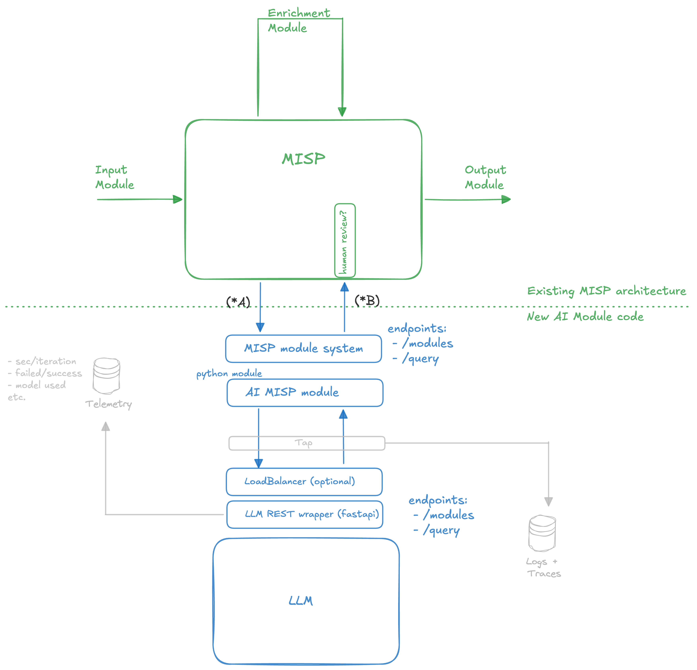

# Architecture 
## PoC version 1

Two years ago, we did a ["CTI Info Extractor" PoC](https://github.com/aaronkaplan/stochasticCTIExtractor)

The architecture was rather simple:


This is just here for reference. We want to improve on that version and make it more generic.


## PoC version 2

After discussions between Alex (Univ. College Dublin), Christian T., Aaron K, Andras (CIRCL), we arrived at the following architecture:



The input parameters (marked as "* A") are:

- model_id
- model_parameters:
    - seed
    - temperature
    - ...
- use-case_category (ex.: "CTI info extraction", "summarization", "forensic info extraction", "image analysis"...)
- system_prompt
- use-case_prompt
- user_prompt
- tlp_level
- pydantic schema
- reference_uploaded_file


The output results (B*) are:

- status_code
- metadata:
    - execution_time
    - model_fingerprint
    - content_hash
    - model_id
    - timestamp
    - etc.
- answer (JSON): the actual content the LLM returned
- extra_tags for the MISP event (think: AI Act tagging "this was AI generated content")


# Appendix


## design ideas

* New type of AI module, MUST support the core MISP module endpoints. It MAY also have other endpoints.:

MISP-modules:
- /version
- /modules
    - GET
- /query
    - POST
    - headers: Content-type: application/json
    - JSON body such as:
        ```
        {
            "module": MODULE_NAME,
            "attribute": {ATTRIBUTE},
            "event_id": EVENT_ID,
            "config": {SETTINGS},
            "timeout": TIMEOUT, // module internal timeout
        }
        ```


## Useful snippets

## Minimal enrichment modules


This is a minimal MISP enrichment module. The AI MISP Module SHOULD also support the same :

```
import json

# custom imports for the module
import dns.resolver


misperrors = {"error": "Error"}
mispattributes = {
    "input": ["hostname", "domain", "domain|ip"]
}

# introscpection metadata
moduleinfo = {
    "version": "0.3",
    "author": "Alexandre Dulaunoy",
    "description": "Simple DNS expansion service to resolve IP address from MISP attributes",
    "module-type": ["expansion", "hover"],
    "name": "DNS Resolver",
    "logo": "",
    "requirements": ["dnspython3: DNS python3 library"],
    "features": (
        "The module takes a domain of hostname attribute as input, and tries to resolve it. If no error is encountered,"
        " the IP address that resolves the domain is returned, otherwise the origin of the error is displayed.\n\nThe"
        " address of the DNS resolver to use is also configurable, but if no configuration is set, we use the Google"
        " public DNS address (8.8.8.8).\n\nPlease note that composite MISP attributes containing domain or hostname are"
        " supported as well."
    ),
    "references": [],
    "input": "Domain or hostname attribute.",
    "output": "IP address resolving the input.",
}

# settings to expose (will be accessible as Plugin.{module_family}_{module_name}_{moduleconfig_key} in MISP)
moduleconfig = ["nameserver"]

# the core logic
def handler(q=False):
    if q is False:
        return False
    request = json.loads(q)
    # Your Magic
    return {"results": {"Object": [], "Attribute": []}}


def introspection():
    return mispattributes


def version():
    moduleinfo["config"] = moduleconfig
    return moduleinfo
```

### Notable endpoints

MISP-modules:
- /modules
    - GET
- /query
    - POST
    - headers: Content-type: application/json
    - JSON body such as:
        ```
        {
            "module": MODULE_NAME,
            "attribute": {ATTRIBUTE},
            "event_id": EVENT_ID,
            "config": {SETTINGS},
            "timeout": TIMEOUT, // module internal timeout
        }
        ``` 

### Current module types:

- Enrichment
    - input: {"params": {}, "data": {MISP_ATTRIBUTE || MISP_OBJECT}
    - output: MISP data
        ```
        {
            "Attribute": [],
            "Objects": [],
            "EventReport": [],
            "Tag": []
        }
        ```
- Export
    - input: {"params": {}, "data": {MISP_EVENT}
    - output: module defined, passed back to MISP as is
- Import
    - input: {"", encoded user input/file upload}
    - output: 
- Action
    - input: 

## Training materials
https://www.misp-project.org/misp-training/3.1-misp-modules.pdf

## Deploying your module

#### Install misp-modules

```
curl -LsSf https://astral.sh/uv/install.sh | sh
uv venv --python=3.12 .venv
source .venv/bin/activate
git clone https://github.com/MISP/misp-modules.git && cd misp-modules
uv pip install .[all]
misp-modules
```

#### Deploy your new misp module

- Copy the module into misp_modules/modules/expansion
- Make sure that the name is in the format /[a-z0-9_]*\.py/
- Restart misp-modules

## Testing your module:

Example using the standard dns module:

request
```
curl -s http://127.0.0.1:6666/query -H "Content-Type: application/json" --data @input.json -X POST
```

response
```
{"results":[{"types":["ip-src","ip-dst"],"values":["142.251.152.119"]}]}
```

