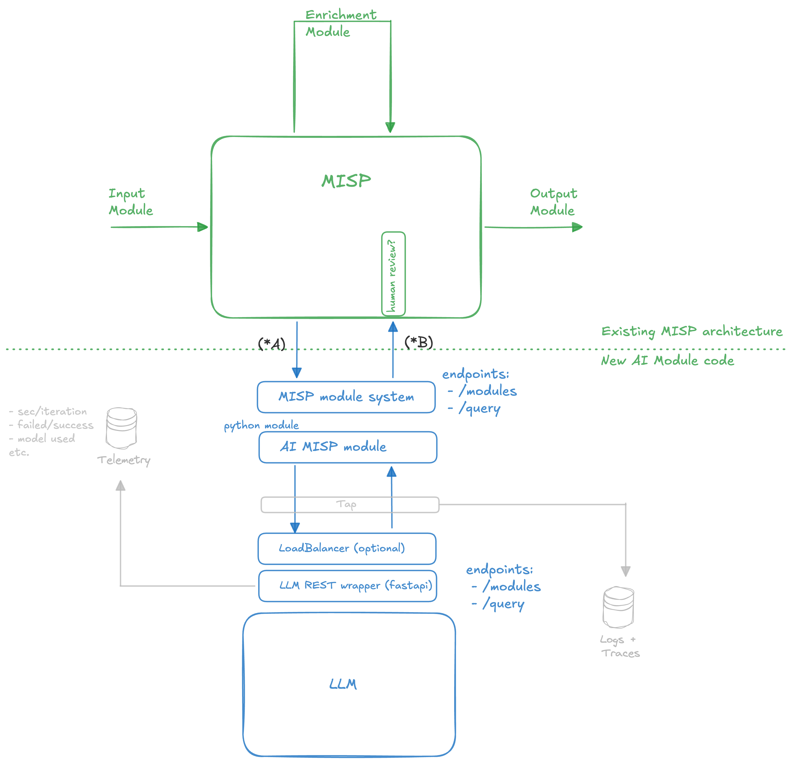

# Architecture 

## Current data flow (v0.3, branch `with_full_event`)

The module no longer works on a single attribute. It takes a **full MISP Event** and returns MISP Events.

```text
caller / MISP ──POST /query──▶ misp-modules ──handler(json)──▶ expansion/generic_ai.py
                                                                  │
   {"event": {"Event": …}}  or  {"data": [{"Event": …}]}          │ _extract_event
                                                                  ▼
                                                    PyMISP MISPEvent.load()   ← validation
                                                                  │  (PyMISPError → {"error": …})
                                                                  ▼
                                                      event: MISPEvent
                                                       │              │
                                          get_event_report(event)     │
                                                       │              │
                                          event_report: str (markdown of all non-deleted EventReports)
                                                       │              │
                                 process_eventReport(event_report)   process_event(event)
                                            → MISPEvent                  → MISPEvent
                                                       └──────┬───────┘
                                                              ▼
              {"results": {"Event": {...}, "ReportEvent": {...}}, "event_report": "..."}
```

`process_event()` dispatches on `use_case` (`none` = pass-through, `extraction`, `summarization`)
to `genai/extract.py` / `genai/summarize.py`; `process_eventReport()` is still a dummy. Code lives
in the `genai/` package because misp-modules loads every `.py` in `expansion/` as a module, so
helpers cannot sit next to `generic_ai.py`; the module adds the repo root to `sys.path` on import.
`genai/classic.py` is the odd one out: a regex baseline over `iocextract` (refang on) that
benchmarks and tests compare the LLM extraction against. It is deliberately not imported by
`generic_ai.py` or `extract.py`, and a unit test keeps it that way.

### Use-case hooks (contract in USE-CASES.md, tests in TESTING.md)

How MISP will call these hooks from its UI (thin per-action entry points around one engine) is
researched in INTEGRATION_PLAN.md; today the module is reachable through the misp-modules
server only.

```text
process_event(event, use_case, …)
   ├─ use_case == "extraction"     → extract_iocs(event)              → event + tagged Attributes/Objects
   └─ use_case == "summarization"  → summarize(event, kind)           → event + tagged EventReport + event tags
                                       kind == "report": input = event_report
                                       kind == "event":  input = render_event(event)  (sorted, deterministic)
both:  prompt cluster (galaxy) ──┐
       input text ───────────────┼─▶ llm_chat(messages, params)  ──▶ post-filters / structural checks ──▶ tag ──▶ event
       sampling params ──────────┘        (one function, OpenAI-compatible chat, JSON mode for UC1)
```

- **LLM boundary**: exactly one function talks to the network (`genai.llm.llm_chat`); tests
  mock it. Endpoint and key come from `.env` only; timeout → error, no fallback. Thinking is
  disabled via `reasoning_effort: none` (Ollama ignores `think: false` on the OpenAI route).
- **Prompt resolution**: `prompt_*` config → galaxy cluster (uuid or value) → inline text →
  bundled default; the cluster also fixes temperature/seed/top_p/max_tokens/think (PROMPTS.md).
- **Tagging**: pinned `ai-computer-assisted` strings on every LLM-suggested attribute (UC1) or
  on the event (UC2). Nothing LLM-made leaves untagged.
- **Metadata** in the response: model name + digest, cluster uuid/version/prompt hash,
  rejected candidates with reasons, timing.

### Schema provenance (why PyMISP validates, not a JSON schema)

Checked on 2026-09-04:

- `MISP/misp-rfc` (`misp-core-format/raw.md`, draft-20): the **prose** defines `EventReport`
  (MUST: `uuid`, `event_id`, `name`, `content`, `distribution`, `sharing_group_id`, `timestamp`,
  `deleted`). The **embedded JSON Schema** (`id` → `MISP/MISP` `format/2.5/schema.json`, last
  substantive change 2018) does not define `EventReport` and sets `additionalProperties: false`
  on `Event`, so it rejects any event that carries a report.
- `MISP/MISP` `format/2.4/schema.json`, `format/2.5/schema.json` (branches 2.4, 2.5, develop): no `EventReport`.
- `MISP/PyMISP` `pymisp/data/schema.json`, `schema-lax.json`: no `EventReport`; PyMISP has
  deprecated `load(validate=True)` because "PyMISP is more flexible at loading events than the schema".

Decision: validation is PyMISP `MISPEvent.load()`. Known gap versus a schema: PyMISP checks
semantics (dates, distributions, required names/values, attribute types) but tolerates unknown
keys. Known PyMISP-vs-MISP mismatch handled in the module: `distribution` / `sharing_group_id` on
default galaxy clusters (MISP emits them, PyMISP rejects them) are dropped before loading.

### Test data

`fixtures/output/*.json` are eight real events exported from the MISP instance in `.env`
(`hashes.csv` lists md5 → uuid). Five carry EventReports. The unit tests, the local misp-modules
e2e test and the live-instance e2e test all use this set, so results are comparable across runs.

### Round-trip quality gate

`process_event(event, e2etest=True)` writes the processed event to `tests/e2etests/<uuid>.json`.
`tests/test_e2e_roundtrip.py` fetches 10 random events from the live instance, runs them through
`validate_event()` → `process_event(..., e2etest=True)` and compares the file with the original via
`tests/misp_compare.py`. The comparator tolerates only PyMISP's own normalisations (null/empty
fields, numeric strings, whitespace, date-time spelling, and four allowlisted paths); any other
difference fails. `validate_event()` builds the event with `force_timestamps=True` because
PyMISP otherwise drops the event `timestamp` from published events it marks as edited.

## PoC version 1

Two years ago, we did a ["CTI Info Extractor" PoC](https://github.com/aaronkaplan/stochasticCTIExtractor)

The architecture was rather simple:


This is just here for reference. We want to improve on that version and make it more generic.


## PoC version 2

After discussions between Alex (Univ. College Dublin), Christian T., Aaron K, Andras (CIRCL), we arrived at the following architecture:



The input parameters (marked as "* A") are:

- model_id
- model_parameters:
    - seed
    - temperature
    - ...
- use-case_category (ex.: "CTI info extraction", "summarization", "forensic info extraction", "image analysis"...)
- system_prompt
- use-case_prompt
- user_prompt
- tlp_level
- pydantic schema
- reference_uploaded_file


The output results (B*) are:

- status_code
- metadata:
    - execution_time
    - model_fingerprint
    - content_hash
    - model_id
    - timestamp
    - etc.
- answer (JSON): the actual content the LLM returned
- extra_tags for the MISP event (think: AI Act tagging "this was AI generated content")


## LLM-suitable knowledge graph representation
An LLM does not need to have the full internal data (linking , object refs, etc) that the MISP format has.
The problem is that the MISP format is too verbose for reasonsing on it. But, it might be a existing in the training data and hence be "understood" (but not in a clean way) by the LLM.
(Question: is it better to create a custom format for the graph structure or better use the existing MISP format?)

Possible structure:
- RDF?
- how to make this in markdown?

How would we evaluate the quality? Probably initially by hand only.
Criteria for evaluations:
- coverage
- correctness
- filter out non-relevant info which is present in the KG but not relevant (for example: domain of mandiant.com, RFC1918 IPs)

XXX __Aaron to do some research in this area__. Are there any models out there already for this? Can we use them for eval? XXX

# Appendix


## design ideas

* New type of AI module, MUST support the core MISP module endpoints. It MAY also have other endpoints.:

MISP-modules:
- /version
- /modules
    - GET
- /query
    - POST
    - headers: Content-type: application/json
    - JSON body such as:
        ```
        {
            "module": MODULE_NAME,
            "attribute": {ATTRIBUTE},
            "event_id": EVENT_ID,
            "config": {SETTINGS},
            "timeout": TIMEOUT, // module internal timeout
        }
        ```


## Useful snippets

## Minimal enrichment modules


This is a minimal MISP enrichment module. The AI MISP Module SHOULD also support the same :

```
import json

# custom imports for the module
import dns.resolver


misperrors = {"error": "Error"}
mispattributes = {
    "input": ["hostname", "domain", "domain|ip"]
}

# introscpection metadata
moduleinfo = {
    "version": "0.3",
    "author": "Alexandre Dulaunoy",
    "description": "Simple DNS expansion service to resolve IP address from MISP attributes",
    "module-type": ["expansion", "hover"],
    "name": "DNS Resolver",
    "logo": "",
    "requirements": ["dnspython3: DNS python3 library"],
    "features": (
        "The module takes a domain of hostname attribute as input, and tries to resolve it. If no error is encountered,"
        " the IP address that resolves the domain is returned, otherwise the origin of the error is displayed.\n\nThe"
        " address of the DNS resolver to use is also configurable, but if no configuration is set, we use the Google"
        " public DNS address (8.8.8.8).\n\nPlease note that composite MISP attributes containing domain or hostname are"
        " supported as well."
    ),
    "references": [],
    "input": "Domain or hostname attribute.",
    "output": "IP address resolving the input.",
}

# settings to expose (will be accessible as Plugin.{module_family}_{module_name}_{moduleconfig_key} in MISP)
moduleconfig = ["nameserver"]

# the core logic
def handler(q=False):
    if q is False:
        return False
    request = json.loads(q)
    # Your Magic
    return {"results": {"Object": [], "Attribute": []}}


def introspection():
    return mispattributes


def version():
    moduleinfo["config"] = moduleconfig
    return moduleinfo
```

### Notable endpoints

MISP-modules:
- /modules
    - GET
- /query
    - POST
    - headers: Content-type: application/json
    - JSON body such as:
        ```
        {
            "module": MODULE_NAME,
            "attribute": {ATTRIBUTE},
            "event_id": EVENT_ID,
            "config": {SETTINGS},
            "timeout": TIMEOUT, // module internal timeout
        }
        ``` 

### Current module types:

- Enrichment
    - input: {"params": {}, "data": {MISP_ATTRIBUTE || MISP_OBJECT}
    - output: MISP data
        ```
        {
            "Attribute": [],
            "Objects": [],
            "EventReport": [],
            "Tag": []
        }
        ```
- Export
    - input: {"params": {}, "data": {MISP_EVENT}
    - output: module defined, passed back to MISP as is
- Import
    - input: {"", encoded user input/file upload}
    - output: 
- Action
    - input: 

## Training materials
https://www.misp-project.org/misp-training/3.1-misp-modules.pdf

## Deploying your module

#### Install misp-modules

```
curl -LsSf https://astral.sh/uv/install.sh | sh
uv venv --python=3.12 .venv
source .venv/bin/activate
git clone https://github.com/MISP/misp-modules.git && cd misp-modules
uv pip install .[all]
misp-modules
```

#### Deploy your new misp module

- Copy the module into misp_modules/modules/expansion
- Make sure that the name is in the format /[a-z0-9_]*\.py/
- Restart misp-modules

## Testing your module:

Example using the standard dns module:

request
```
curl -s http://127.0.0.1:6666/query -H "Content-Type: application/json" --data @input.json -X POST
```

response
```
{"results":[{"types":["ip-src","ip-dst"],"values":["142.251.152.119"]}]}
```

