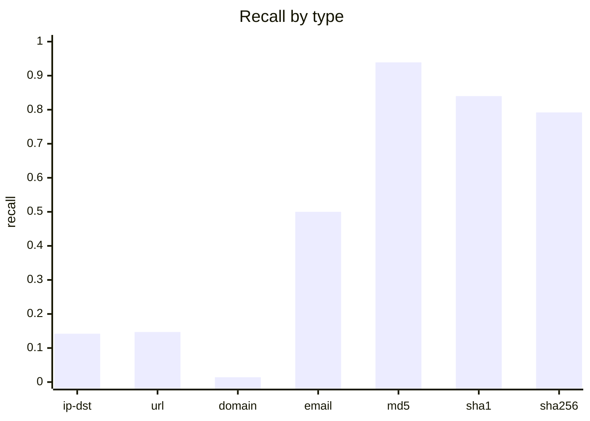
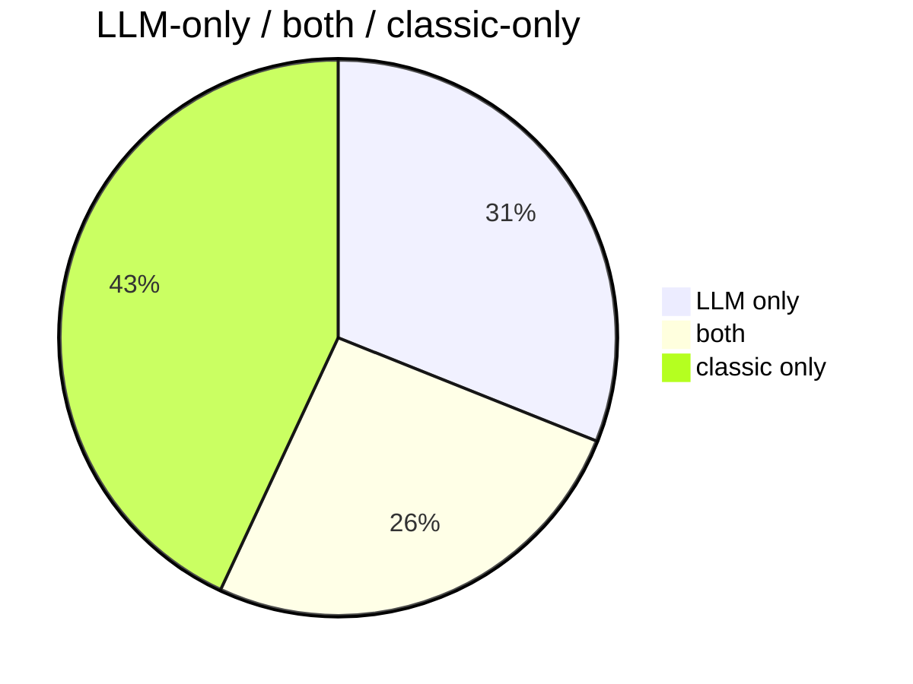
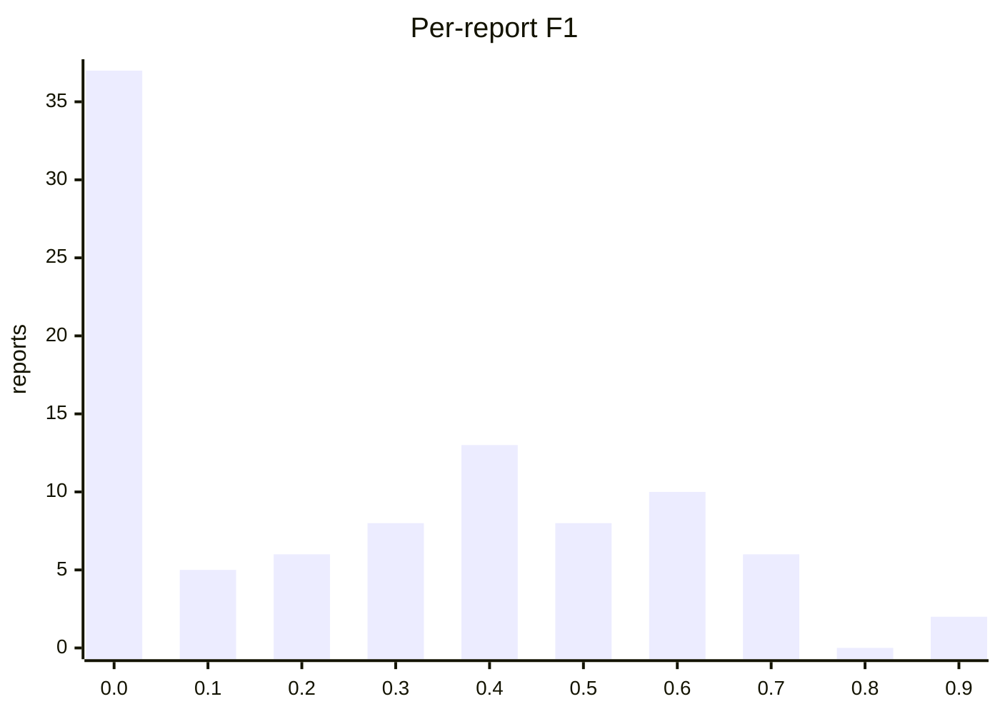

# Extraction benchmark: LLM vs classic regex extractor

Date: 2026-09-05. Sample: seed 42, n 100, reports with
results 100, reports with LLM errors 5.

- Model: `qwen3.8:latest` digest `22130167c4c2` server `ollama 0.33.2`
- Prompt: `cti-info-extraction/qwen3.8-v1` v1 sha256 `9adaea95ee9ed16546dc141da3317b8aec6907dd983d682e92da6be9d1ab0757`
- Classic tool: `iocextract 1.16.1`

**Method.** Indicators are compared by normalised value only (lower-case, trailing `/` and `.`
stripped); types are ignored. The classic extractor is a deliberate *superset* reference (it also
catches defanged values), so an LLM "false positive" is a value the regexes missed and an LLM
"false negative" may be a correct omission (e.g. the reporting vendor's own site). Specificity and
accuracy need a wider universe than `llm ∪ classic` and are only meaningful in the gold view.

## LLM vs classic (95 reports)

### Confusion matrix (micro counts)

|  | classic yes | classic no | total |
|---|---|---|---|
| LLM yes | 550 | 660 | 1210 |
| LLM no | 915 | 0 | 915 |
| total | 1465 | 660 | 2125 |

### Metrics

| metric | micro | macro (mean per report) |
|---|---|---|
| precision | 0.455 | 0.360 |
| recall | 0.375 | 0.298 |
| specificity | 0.000 | 0.000 |
| accuracy | 0.259 | 0.208 |
| f1 | 0.411 | 0.295 |
| jaccard | 0.259 | 0.208 |
| cohen_kappa | -0.565 | -0.332 |

### Recall of classic values by type

| type | classic n | recall |
|---|---|---|
| domain | 216 | 0.014 |
| email | 14 | 0.500 |
| ip-dst | 127 | 0.142 |
| md5 | 131 | 0.939 |
| sha1 | 75 | 0.840 |
| sha256 | 317 | 0.792 |
| url | 586 | 0.147 |


### Agreement



### Per-report F1 histogram



### Reports by recall and precision

```mermaid
quadrantChart
  title Reports by recall (x) and precision (y)
  x-axis "low recall" --> "high recall"
  y-axis "low precision" --> "high precision"
  quadrant-1 agree
  quadrant-2 LLM strict
  quadrant-3 disagree
  quadrant-4 LLM generous
  8e804b2b: [0.000, 0.000]
  540efc3c: [0.556, 0.368]
  d27118be: [0.200, 0.333]
  8cb9ac5c: [0.778, 0.538]
  c9acfc88: [0.182, 0.364]
  d256214e: [0.579, 0.647]
  45f70928: [0.500, 0.600]
  662a629b: [0.000, 0.000]
  7d04b6ff: [0.500, 0.407]
  082d3389: [0.824, 0.326]
  f22ca523: [0.000, 0.000]
  0d759389: [0.000, 0.000]
  712ff0fc: [0.182, 1.000]
  0173351d: [0.000, 0.000]
  c191576a: [0.400, 0.571]
  93f7b554: [0.167, 0.333]
  6eeb84e3: [0.100, 0.500]
  fdb2627c: [0.000, 0.000]
  ea50871d: [0.757, 0.636]
  c143dbde: [0.000, 0.000]
  7d02b3fa: [0.000, 0.000]
  0e1ee8a9: [0.143, 0.250]
  405f54ff: [0.706, 0.480]
  1405a5dc: [0.500, 0.333]
  6cc03d12: [0.000, 0.000]
  78d08d87: [0.276, 0.421]
  68303cde: [0.000, 0.000]
  69b2b5d5: [0.000, 0.000]
  fbb37538: [0.000, 0.000]
  d740af4f: [0.000, 0.000]
  10524cc8: [0.967, 0.879]
  e0234eb8: [0.500, 0.222]
  b376f09a: [0.000, 0.000]
  9d745433: [0.353, 0.207]
  f9158c72: [0.882, 0.385]
  cc13367a: [0.444, 1.000]
  52cbaed5: [0.000, 0.000]
  4e697d2e: [0.500, 1.000]
  11def925: [0.109, 0.400]
  36f4a46a: [0.786, 0.733]
  53ecd031: [0.280, 1.000]
  53d99aad: [0.000, 0.000]
  59058517: [0.333, 0.600]
  5b6dbdb5: [0.778, 0.700]
  07e04656: [0.909, 0.909]
  be97537d: [0.549, 0.966]
  13edb894: [0.000, 0.000]
  731ff89d: [0.250, 0.667]
  5f36e25e: [0.000, 0.000]
  03e9e845: [0.282, 0.688]
  d1d74b29: [0.750, 0.429]
  536e5094: [0.667, 0.381]
  014c75a7: [0.000, 0.000]
  12b3fde8: [0.000, 0.000]
  40301ca4: [0.000, 0.000]
  d72a26f9: [0.000, 0.000]
  bd43481b: [0.000, 0.000]
  20649884: [0.611, 0.524]
  cc825515: [0.571, 0.400]
  b131f886: [0.719, 0.852]
```

### Indicator counts per extractor

```mermaid
xychart-beta
  title "Indicators per type"
  x-axis ["ip-dst", "url", "domain", "email", "md5", "sha1", "sha256"]
  y-axis "classic / llm" 0 --> 588
  bar [127, 588, 216, 14, 134, 75, 321]
  bar [16, 92, 29, 0, 121, 61, 251]
```



### Per report

| id | title | classic n | llm n | tp | fp | fn | precision | recall | f1 | kappa | seconds |
|---|---|---|---|---|---|---|---|---|---|---|---|
| 8e804b2b-e84d-4eb4-b6ca-d4b0fdb21aee | With Upgrades in Delivery and Support In | 6 | 5 | 0 | 5 | 6 | 0.000 | 0.000 | 0.000 | -0.984 | 21.342 |
| 540efc3c-e3f9-437c-9684-eef5d0262a77 | 2020-05-21 - No “Game over” for the Winn | 45 | 68 | 25 | 43 | 20 | 0.368 | 0.556 | 0.442 | -0.450 | 163.889 |
| d27118be-8a8f-4660-994e-7450c6d80ab1 | A Pretty Dope Story About Bears: Early I | 5 | 3 | 1 | 2 | 4 | 0.333 | 0.200 | 0.250 | -0.615 | 12.029 |
| 8cb9ac5c-b5dd-45a5-80d9-56dbdacdbc5a | Operation Bleeding Bear | 9 | 13 | 7 | 6 | 2 | 0.538 | 0.778 | 0.636 | -0.250 | 39.176 |
| c9acfc88-6f0e-4ded-94f3-8e6985871d86 | 2021-11-02 - Underminer Exploit Kit- The | 22 | 11 | 4 | 7 | 18 | 0.364 | 0.182 | 0.242 | -0.533 | 44.689 |
| d256214e-8231-4909-91e7-e2dfbe7f31f4 | 2017-07-24 - Real News, Fake Flash- Mac  | 19 | 17 | 11 | 6 | 8 | 0.647 | 0.579 | 0.611 | -0.378 | 40.181 |
| 45f70928-55c0-4208-9f4e-75c1a1ba1d26 | 2010-03-07 - March 2010 Opachki Trojan u | 6 | 5 | 3 | 2 | 3 | 0.600 | 0.500 | 0.545 | -0.429 | 22.600 |
| 662a629b-5164-483c-acf3-7741fd42edb5 | IssueMakersLab - Cyber Warfare Research  | 22 | 0 | 0 | 0 | 22 | 0.000 | 0.000 | 0.000 | 0.000 | 17.325 |
| 7d04b6ff-183f-42d5-8508-8e52f1a00bbf | Rancor: Cyber Espionage Group Uses New C | 26 | 27 | 11 | 16 | 11 | 0.407 | 0.500 | 0.449 | -0.522 | 96.040 |
| 082d3389-8415-4dc9-8355-91a8ff03a6d7 | Cutting Edge, Part 3: Investigating Ivan | 17 | 43 | 14 | 29 | 3 | 0.326 | 0.824 | 0.467 | -0.134 | 103.756 |
| f22ca523-b736-4340-9ed2-bacc2a123910 | Secure Communications Blog | 2 | 0 | 0 | 0 | 2 | 0.000 | 0.000 | 0.000 | 0.000 | 3.916 |
| 0d759389-9c2f-45fc-9e94-7fe3617ce50b | 2017-10-13 - FIN7 Dissected- Hackers Acc | 0 | 2 | 0 | 2 | 0 | 0.000 | 0.000 | 0.000 | 0.000 | 3.863 |
| 712ff0fc-e931-40f9-bc34-299b70a12075 | Hagga of SectorH01 continues abusing Bit | 55 | 10 | 10 | 0 | 45 | 1.000 | 0.182 | 0.308 | 0.000 | 111.170 |
| 0173351d-ecc3-4815-a3ad-05720e6d7773 | Chafer: Latest Attacks Reveal Heightened | 36 | 7 | 0 | 7 | 36 | 0.000 | 0.000 | 0.000 | -0.375 | 48.283 |
| c191576a-2829-4fd3-9e06-d34390fac314 |  | 30 | 21 | 12 | 9 | 18 | 0.571 | 0.400 | 0.471 | -0.444 | 73.049 |
| 93f7b554-a14b-46a5-8c6a-612fec57668b | 2020-10-11 - Chimera, APT19 under the ra | 6 | 3 | 1 | 2 | 5 | 0.333 | 0.167 | 0.222 | -0.556 | 13.854 |
| 6eeb84e3-8986-48e4-9441-145d10cb8f02 | 2020-01-23 - German language malspam pus | 40 | 8 | 4 | 4 | 36 | 0.500 | 0.100 | 0.167 | -0.196 | 76.083 |
| fdb2627c-d5dc-4601-bfbe-bf446e27ba17 | Treasury Sanctions China-based Hacker In | 2 | 8 | 0 | 8 | 2 | 0.000 | 0.000 | 0.000 | -0.471 | 13.054 |
| ea50871d-6809-483c-8777-07924f8c9419 | COVID-19 and New Year greetings: an inve | 37 | 44 | 28 | 16 | 9 | 0.636 | 0.757 | 0.691 | -0.278 | 188.603 |
| c143dbde-a82b-46b6-9bfe-21c8c18905e7 | HP_Bromium_Threat_Insights_Report_Q4_202 | 33 | 2 | 0 | 2 | 33 | 0.000 | 0.000 | 0.000 | -0.121 | 10.512 |
| 7d02b3fa-342e-4857-b094-85c65c96779c | New threat actor, UAT-9921, leverages Vo | 2 | 5 | 0 | 5 | 2 | 0.000 | 0.000 | 0.000 | -0.690 | 12.861 |
| 0e1ee8a9-df19-40ed-b899-4e825353b0e6 | 2017-11-15 - New EMOTET Hijacks a Window | 21 | 12 | 3 | 9 | 18 | 0.250 | 0.143 | 0.182 | -0.667 | 39.044 |
| 405f54ff-1a60-4f56-a8ed-7a502e0445fc | MMD-0064-2019 - Linux/AirDropBot | 34 | 50 | 24 | 26 | 10 | 0.480 | 0.706 | 0.571 | -0.317 | 146.949 |
| 1405a5dc-c3f2-4f58-8c62-46c8367e62f0 | Authorities confirm RagnarLocker ransomw | 2 | 3 | 1 | 2 | 1 | 0.333 | 0.500 | 0.400 | -0.500 | 47.305 |
| 6cc03d12-f2bd-4227-aca9-882cf2deed9d | New Apple Mac Trojan Called OSX/Crisis D | 4 | 2 | 0 | 2 | 4 | 0.000 | 0.000 | 0.000 | -0.800 | 54.091 |
| 78d08d87-e069-48aa-bdf8-e0f677503ce2 | ZINC weaponizing open-source software |  | 29 | 19 | 8 | 11 | 21 | 0.421 | 0.276 | 0.333 | -0.565 | 84.322 |
| 68303cde-3001-483f-837d-4571efae2158 | 1,400 Pegasus spyware infections detaile | 2 | 2 | 0 | 2 | 2 | 0.000 | 0.000 | 0.000 | -1.000 | 6.642 |
| 69b2b5d5-53fd-46c9-95de-dd95527a8649 | 2020-12-02 - ‘Shadow Academy’ Targets 20 | 1 | 6 | 0 | 6 | 1 | 0.000 | 0.000 | 0.000 | -0.324 | 12.629 |
| fbb37538-3879-45ae-980e-a549a3f54d9b | Censys Blog | Cybersecurity Insights & T | 3 | 0 | 0 | 0 | 3 | 0.000 | 0.000 | 0.000 | 0.000 | 3.549 |
| d740af4f-cd35-4cc9-a33b-4cf450aaf816 | Enabling or disabling Lockdown mode on a | 2 | 0 | 0 | 0 | 2 | 0.000 | 0.000 | 0.000 | 0.000 | 3.409 |
| 10524cc8-bf09-47e5-bcc7-0f9e5ec1c061 | 2020-03-21 - On the Royal Road | 30 | 33 | 29 | 4 | 1 | 0.879 | 0.967 | 0.921 | -0.049 | 129.621 |
| e0234eb8-0ea8-4087-87e7-7aa11fcacd46 | Passive Income of Cyber Criminals: Disse | 5 | 9 | 2 | 7 | 2 | 0.222 | 0.500 | 0.308 | -0.394 | 20.489 |
| b376f09a-1824-4881-8847-35d66d236ba2 | Advisories are published, but are enough | 2 | 5 | 0 | 5 | 2 | 0.000 | 0.000 | 0.000 | -0.690 | 8.066 |
| 9d745433-260f-4b45-bc4c-372a71aa8b56 |  | 17 | 29 | 6 | 23 | 11 | 0.207 | 0.353 | 0.261 | -0.593 | 93.705 |
| f9158c72-03d6-4e82-a9fa-cf9680adbdcd | Medre.A - AutoCAD worm samples | 17 | 39 | 15 | 24 | 2 | 0.385 | 0.882 | 0.536 | -0.099 | 111.757 |
| cc13367a-315e-4d21-9ebf-184092d35371 | Enterprise Scale Threat Hunting: C2 Beac | 9 | 4 | 4 | 0 | 5 | 1.000 | 0.444 | 0.615 | 0.000 | 8.593 |
| 52cbaed5-b357-4ba4-949f-9b846045446a | 2020-04-08 - How Cyber Adversaries are A | 0 | 24 | 0 | 24 | 0 | 0.000 | 0.000 | 0.000 | 0.000 | 37.651 |
| 4e697d2e-8ecf-4947-b43e-2c18b8298aa8 | Adobe To Announce Source Code, Customer  | 2 | 1 | 1 | 0 | 1 | 1.000 | 0.500 | 0.667 | 0.000 | 5.127 |
| 11def925-953a-4785-af7e-27d88970460c | CryptoClippy is Evolving to Pilfer Even  | 56 | 16 | 6 | 9 | 49 | 0.400 | 0.109 | 0.171 | -0.312 | 190.900 |
| 36f4a46a-d4d6-49dd-89c0-0c7fac1356eb | 2020-09-17 - Complex obfuscation- Meh… ( | 14 | 15 | 11 | 4 | 3 | 0.733 | 0.786 | 0.759 | -0.235 | 49.795 |
| 53ecd031-d5cc-491f-93cb-6d516b242723 | 2022-11-15 - New RapperBot Campaign – We | 25 | 7 | 7 | 0 | 18 | 1.000 | 0.280 | 0.438 | 0.000 | 69.777 |
| 53d99aad-54d9-44f7-9161-f4346320da12 | CAPEC-163: Spear Phishing (Version 3.9) | 2 | 2 | 0 | 2 | 2 | 0.000 | 0.000 | 0.000 | -1.000 | 12.497 |
| 59058517-476f-42b7-a8ff-6b06b85e1c4d | 2021-06-17 - New TA402 Molerats Malware  | 18 | 10 | 6 | 4 | 12 | 0.600 | 0.333 | 0.429 | -0.375 | 48.071 |
| 5b6dbdb5-7232-4d88-b1cd-cda6e02c9d82 | 2016-11-08 - Analysis of iOSGuiInject Ad | 54 | 60 | 42 | 18 | 12 | 0.700 | 0.778 | 0.737 | -0.250 | 137.203 |
| 07e04656-9d85-45ee-9f71-ea6a4f787881 | 2022-03-11 - New Wiper Malware Attacking | 22 | 22 | 20 | 2 | 2 | 0.909 | 0.909 | 0.909 | -0.091 | 70.775 |
| be97537d-9a58-4756-af78-49314e7c10dc | 2023-01-26 - Welcome to Goot Camp- Track | 51 | 29 | 28 | 1 | 23 | 0.966 | 0.549 | 0.700 | -0.038 | 193.854 |
| 13edb894-84e6-4415-ba72-43c6d5cd4da9 | 2009-08-05 - PC Users Threatened by Conf | 0 | 8 | 0 | 8 | 0 | 0.000 | 0.000 | 0.000 | 0.000 | 12.613 |
| 731ff89d-2473-41f6-a29a-10a7b1a21221 | New “CleverSoar” Installer Targets Chine | 8 | 3 | 2 | 1 | 6 | 0.667 | 0.250 | 0.364 | -0.235 | 11.074 |
| 5f36e25e-4cfd-4cc8-8476-8a21405a80cc | Web skimmers found on the websites of In | 2 | 1 | 0 | 1 | 2 | 0.000 | 0.000 | 0.000 | -0.800 | 4.593 |
| 03e9e845-dd6f-41aa-ae06-0f700f8b6209 | ErrorFather's Cerberus: Amplifying Cyber | 39 | 16 | 11 | 5 | 28 | 0.688 | 0.282 | 0.400 | -0.239 | 107.671 |
| d1d74b29-dfae-465f-bde6-95e3789d35c5 | Nobelium Returns to the Political World  | 5 | 7 | 3 | 4 | 1 | 0.429 | 0.750 | 0.545 | -0.250 | 23.630 |
| 536e5094-0063-4752-8c4f-492ae30c636d | Gamaredon group grows its game | 12 | 21 | 8 | 13 | 4 | 0.381 | 0.667 | 0.485 | -0.324 | 50.295 |
| 014c75a7-0397-46b8-a722-f3cdca20a203 | US aerospace services provider breached  | 2 | 6 | 0 | 6 | 2 | 0.000 | 0.000 | 0.000 | -0.600 | 11.456 |
| 12b3fde8-4bca-4a69-a632-c4fbb17388ea | SonicALERT: CVE 2014-0322 Malware - Saku | 2 | 3 | 0 | 3 | 2 | 0.000 | 0.000 | 0.000 | -0.923 | 8.265 |
| 40301ca4-fed9-4b59-95ba-b668eb8eb7aa | 2018-11-27 - Meet CrowdStrike’s Adversar | 0 | 8 | 0 | 8 | 0 | 0.000 | 0.000 | 0.000 | 0.000 | 12.432 |
| d72a26f9-8c68-4211-9724-f56248338daa | 2023-01-24 - DragonSpark - Attacks Evade | 33 | 3 | 0 | 3 | 33 | 0.000 | 0.000 | 0.000 | -0.180 | 61.844 |
| bd43481b-2327-459f-b28d-2190e5c53c2e | LAPSUS$: Recent techniques, tactics and  | 9 | 0 | 0 | 0 | 9 | 0.000 | 0.000 | 0.000 | 0.000 | 9.791 |
| 20649884-ffe0-4fa6-aa3a-6e4e28d041c8 | North Korean hackers are skimming US and | 18 | 21 | 11 | 10 | 7 | 0.524 | 0.611 | 0.564 | -0.417 | 42.505 |
| cc825515-25a8-40ef-8eb0-fc8647a2a6fc | 2022-08-25 - New Golang Ransomware Agend | 7 | 10 | 4 | 6 | 3 | 0.400 | 0.571 | 0.471 | -0.444 | 37.204 |
| b131f886-5ffa-423f-a28e-d3bc0b9c094a | IcedID Campaign Spotted Being Spiced Wit | 32 | 27 | 23 | 4 | 9 | 0.852 | 0.719 | 0.780 | -0.182 | 113.870 |
| 6970d678-af35-45eb-a737-ae6dff7f95bb | Yokogawa announcement warns of counterfe | 3 | 1 | 1 | 0 | 2 | 1.000 | 0.333 | 0.500 | 0.000 | 4.722 |
| 97271a6a-85e2-4e34-afd8-4ef4fcea8001 | Probable Iranian Cyber Actors, Static Ki | 39 | 18 | 8 | 10 | 31 | 0.444 | 0.205 | 0.281 | -0.446 | 43.432 |
| 2ddc0184-fa5c-43d9-971f-2063eed1f473 | Latest Cyber Threat Intelligence & Secur | 53 | 34 | 0 | 34 | 53 | 0.000 | 0.000 | 0.000 | -0.909 | 61.980 |
| 88425055-d1e5-4ee5-99fc-9da64837161d | Equinix data center giant hit by Netwalk | 4 | 3 | 0 | 3 | 4 | 0.000 | 0.000 | 0.000 | -0.960 | 7.350 |
| 7d044e79-5cff-47b3-a06d-71ba997d3aa0 | 2022-01-21 - A deeper UEFI dive into Moo | 2 | 3 | 0 | 3 | 2 | 0.000 | 0.000 | 0.000 | -0.923 | 11.528 |
| 428fd94c-4beb-4216-9997-9b9aaf872b21 | Threat Analysis: Active C2 Discovery Usi | 8 | 3 | 0 | 3 | 8 | 0.000 | 0.000 | 0.000 | -0.658 | 14.406 |
| 43cd6667-c47f-4b9c-a2be-acc4d152d63d |  | 0 | 1 | 0 | 1 | 0 | 0.000 | 0.000 | 0.000 | 0.000 | 4.326 |
| ca2af944-50d1-451f-b2f1-07b599d43b73 | Waterbear Returns, Uses API Hooking to E | 22 | 24 | 18 | 6 | 4 | 0.750 | 0.818 | 0.783 | -0.207 | 93.135 |
| 881ef0cf-5e33-418f-96ce-f36b5e5525dd | 2021-04-12 - A chat with DarkSide | 0 | 1 | 0 | 1 | 0 | 0.000 | 0.000 | 0.000 | 0.000 | 8.212 |
| c266b9cf-17a6-4cfc-b6a2-c5544aa8bf9b | Daxin Backdoor: In-Depth Analysis, Part  | 7 | 5 | 4 | 1 | 3 | 0.800 | 0.571 | 0.667 | -0.231 | 14.339 |
| c58b4df0-ab21-460e-adbf-23c5c8b30ccd | FBI seize BreachForums hacking forum use | 3 | 9 | 1 | 8 | 2 | 0.111 | 0.333 | 0.167 | -0.410 | 22.857 |
| a5d54f81-2d95-4598-9ea7-8648c79c0e06 | 2019-05-02 - Detricking TrickBot Loader | 27 | 32 | 0 | 32 | 27 | 0.000 | 0.000 | 0.000 | -0.986 | 117.567 |
| 9fcc0e30-0309-40cc-be0e-424d0185f335 | Parrot TDS takes over web servers and th | 11 | 3 | 1 | 2 | 10 | 0.333 | 0.091 | 0.143 | -0.345 | 9.668 |
| 198f65d2-3283-460b-84bc-0394d7cbbb0e | DanaBot: A New Banking Trojan Targeting  | 31 | 7 | 6 | 1 | 25 | 0.857 | 0.194 | 0.316 | -0.064 | 52.036 |
| 37cabd68-a29c-4e5a-9020-9f8468a21fe4 | Rorschach – A New Sophisticated and Fast | 5 | 58 | 3 | 55 | 2 | 0.052 | 0.600 | 0.095 | -0.069 | 86.749 |
| 226d6c53-ef8e-455b-bb6f-48058bf96635 | 2014-05-13 - Cat Scratch Fever- CrowdStr | 5 | 8 | 2 | 5 | 3 | 0.286 | 0.400 | 0.333 | -0.600 | 17.909 |
| 5ffd1c8b-ea76-4a97-959a-8a6601dd0f73 | 2021-10-21 - Cobalt Strike- Using Known  | 0 | 2 | 0 | 2 | 0 | 0.000 | 0.000 | 0.000 | 0.000 | 5.489 |
| 64b77888-2d30-48e2-80c2-6b0b9a254db5 | 2020-12-15 - Removing Coordinated Inauth | 0 | 2 | 0 | 2 | 0 | 0.000 | 0.000 | 0.000 | 0.000 | 10.115 |
| e4fec4d0-8262-4692-9866-4c09652b652a | 2020-12-22 - Leftover Lunch- Finding, Hu | 23 | 24 | 10 | 14 | 13 | 0.417 | 0.435 | 0.426 | -0.573 | 69.467 |
| d43f68c1-fcde-4481-92f9-920a2509a249 | CVE-2022-23812 | RIAEvangelist/node-ipc  | 12 | 4 | 3 | 1 | 9 | 0.750 | 0.250 | 0.375 | -0.161 | 13.073 |
| 3b452297-cd55-4743-b1f7-741f558a30c8 | 2022-04-14 - Orion Threat Alert- Flight  | 27 | 18 | 9 | 9 | 18 | 0.500 | 0.333 | 0.400 | -0.500 | 80.659 |
| d0d69f14-ce3e-4069-a77a-c3f4661dc1df | VERMIN: Quasar RAT and Custom Malware Us | 85 | 38 | 32 | 6 | 53 | 0.842 | 0.376 | 0.520 | -0.134 | 193.844 |
| e0f1ad2e-49e3-4f62-8c33-9754426b1b27 | Blackhole Ramnit - samples and analysis | 37 | 19 | 10 | 9 | 24 | 0.526 | 0.294 | 0.377 | -0.438 | 41.119 |
| a9b8e5c7-a287-40f9-bf3a-1e188b94cee5 | Important Detection and Remediation Acti | 2 | 2 | 1 | 1 | 1 | 0.500 | 0.500 | 0.500 | -0.500 | 6.117 |
| 79a42502-2174-4138-9838-715426a8e449 | Some notes on IoCs | 2 | 1 | 1 | 0 | 1 | 1.000 | 0.500 | 0.667 | 0.000 | 4.588 |
| 09ce4b89-5222-457d-a887-4595d636644b | 2017-10-05 - FreeMilk- A Highly Targeted | 24 | 29 | 18 | 11 | 6 | 0.621 | 0.750 | 0.679 | -0.285 | 93.937 |
| c91d14a0-dd48-4b5c-92e5-c602bde66e1c | ZIP files, make it bigger to avoid EDR d | 3 | 2 | 1 | 1 | 2 | 0.500 | 0.333 | 0.400 | -0.500 | 5.709 |
| 94486493-db69-494a-9eba-157c17bc0127 | Research, News, and Perspectives | 2 | 0 | 0 | 0 | 2 | 0.000 | 0.000 | 0.000 | 0.000 | 3.515 |
| 4c375f8c-a405-4927-930c-97fdfd69e972 | 2021-11-18 - Two Iranian Nationals Charg | 0 | 2 | 0 | 2 | 0 | 0.000 | 0.000 | 0.000 | 0.000 | 10.183 |
| 2dd4dea5-a859-4ba4-b25c-ce158e084017 | 2020-11-18 - Business as usual- Criminal | 9 | 12 | 8 | 4 | 1 | 0.667 | 0.889 | 0.762 | -0.140 | 44.203 |
| 283b3f32-ea0a-4e05-b871-556307952612 | Cloud Security - Palo Alto Networks Blog | 2 | 0 | 0 | 0 | 2 | 0.000 | 0.000 | 0.000 | 0.000 | 6.876 |
| e60bcd10-a59d-4e73-8764-e5eb716bced7 | 2022-12-20 - Lazarus APT’s Operation Int | 2 | 5 | 1 | 4 | 1 | 0.200 | 0.500 | 0.286 | -0.364 | 9.386 |
| 114744a5-256d-45fc-b95c-bb0b68619145 | 2020-05-04 - ATM malware targets Wincor  | 4 | 2 | 2 | 0 | 2 | 1.000 | 0.500 | 0.667 | 0.000 | 7.890 |
| 00414a04-1453-42cd-ae50-42c2a761b837 | SoumniBot: the new Android banker’s uniq | 8 | 4 | 4 | 0 | 4 | 1.000 | 0.500 | 0.667 | 0.000 | 13.990 |
| eda4d990-63ba-47a8-90fc-1cbcea0f8d06 | Windows PWDUMP tools | 2 | 1 | 0 | 1 | 2 | 0.000 | 0.000 | 0.000 | -0.800 | 5.713 |

## Deviations

### LLM-only values (what the regexes missed), top 50

| id | type | value |
|---|---|---|
| 8e804b2b | domain | blogspot.com |
| 8e804b2b | filename | 29[.]html |
| 8e804b2b | filename | blog-page[.]html |
| 8e804b2b | filename | mshta.exe |
| 8e804b2b | malware-type | Revenge RAT |
| 540efc3c | filename | B0SDFUWEkNCj.logN |
| 540efc3c | filename | Core.dll |
| 540efc3c | filename | CoreLnc.dll |
| 540efc3c | filename | CrLnc.dat |
| 540efc3c | filename | D8JNCKS0DJE |
| 540efc3c | filename | DEment.dll |
| 540efc3c | filename | Duser.dll |
| 540efc3c | filename | EntAppsvc.dll |
| 540efc3c | filename | Interactive.dll |
| 540efc3c | filename | JSONDIU7c9djE |
| 540efc3c | filename | License.hwp |
| 540efc3c | filename | Net.dll |
| 540efc3c | filename | PrintDialog.dll |
| 540efc3c | filename | PrintDialog.exe |
| 540efc3c | filename | Win32CmdDll.dll |
| 540efc3c | filename | banner.bmp |
| 540efc3c | filename | certificate.cert |
| 540efc3c | filename | osksupport.dll |
| 540efc3c | filename | setup.dll |
| 540efc3c | filename | setup.exe |
| 540efc3c | filename | setup0.exe |
| 540efc3c | malware-type | AceHash |
| 540efc3c | malware-type | PipeMon |
| 540efc3c | malware-type | ShadowPad |
| 540efc3c | malware-type | Winnti |
| 540efc3c | named pipe | \\.\pipe\CMDPipeRead |
| 540efc3c | named pipe | \\.\pipe\CMDPipeWrite |
| 540efc3c | named pipe | \\.\pipe\ComHeatPipeRead%B64_TIMESTAMP% |
| 540efc3c | named pipe | \\.\pipe\FilePipeRead%B64_TIMESTAMP% |
| 540efc3c | named pipe | \\.\pipe\FilePipeWrite%B64_TIMESTAMP% |
| 540efc3c | named pipe | \\.\pipe\InCmdPipeRead%B64_TIMESTAMP% |
| 540efc3c | named pipe | \\.\pipe\InCmdPipeWrite%B64_TIMESTAMP% |
| 540efc3c | named pipe | \\.\pipe\MainHeatPipeRead%B64_TIMESTAMP% |
| 540efc3c | named pipe | \\.\pipe\MainPipeRead%B64_TIMESTAMP% |
| 540efc3c | named pipe | \\.\pipe\MainPipeWrite%B64_TIMESTAMP% |
| 540efc3c | named pipe | \\.\pipe\RoutePipeWriite%B64_TIMESTAMP% |
| 540efc3c | named pipe | \\.\pipe\ScreenPipeRead%CNC_DEFINED% |
| 540efc3c | named pipe | \\.\pipe\ScreenPipeWrite%CNC_DEFINED% |
| 540efc3c | regkey | HKLM\SOFTWARE\Microsoft\Print\Components\A66F35-4164-45FF-9CB4-69ACAA10E52D |
| 540efc3c | regkey | HKLM\SOFTWARE\Microsoft\Print\Components\DC20FD7E-4B1B-4B88-8172-61F0BED7D9E8 |
| 540efc3c | regkey | HKLM\SYSTEM\ControlSet001\Control\Print\Environments\Windows x64\Print Processors\PrintFiiterPipelineSvc\Driver |
| 540efc3c | regkey | HKLM\SYSTEM\CurrentControlSet\Control\Print\Environments\Windows x64\Print Processors\lltdsvc1\Driver |
| 540efc3c | threat-actor | Winnti Group |
| d27118be | threat-actor | APT28 |
| d27118be | threat-actor | Fancy Bear |

### Classic-only values (what the LLM left out), first 10 per type

reporter-domain: 108, other: 810 (of 918 classic-only values)

| id | type | value | flag |
|---|---|---|---|
| 8e804b2b | domain | web.archive.org | reporter-domain |
| 8cb9ac5c | domain | www.elastic.co | reporter-domain |
| c9acfc88 | domain | intel471.com |  |
| c9acfc88 | domain | socprime.com |  |
| c9acfc88 | domain | www.aldeid.com |  |
| c9acfc88 | domain | www.bleepingcomputer.com |  |
| c9acfc88 | domain | www.trendmicro.com |  |
| d256214e | domain | get.adobe.com |  |
| d256214e | domain | updatesec.webredirect.org |  |
| 45f70928 | domain | www.threatexpert.com |  |
| 540efc3c | email | threatintel@eset.com |  |
| 6eeb84e3 | email | malware-traffic-analysis.net |  |
| fbb37538 | email | connect@censys.com | reporter-domain |
| 9fcc0e30 | email | ti@avast.com |  |
| 226d6c53 | email | intelligence@crowdstrike.com |  |
| d0d69f14 | email | jcortes@paloaltonetworks.com |  |
| e0f1ad2e | email | contact@privacyprotect.org |  |
| 540efc3c | ip-dst | 0.0.0.0 |  |
| 540efc3c | ip-dst | 1.1.1.4 |  |
| 540efc3c | ip-dst | 1.1.1.5 |  |
| 540efc3c | ip-dst | 154.223.215.116 |  |
| 540efc3c | ip-dst | 203.86.239.113 |  |
| c9acfc88 | ip-dst | 169.197.142.162 |  |
| c9acfc88 | ip-dst | 194.124.213.221 |  |
| d256214e | ip-dst | 176.9.0.0 |  |
| d256214e | ip-dst | 213.200.0.0 |  |
| d256214e | ip-dst | 45.77.52.0 |  |
| ea50871d | md5 | 500b6037ddb5efff0dd91f75b22ccce5 |  |
| 78d08d87 | md5 | 0CE1241A44557AA438F27BC6D4ACA246 |  |
| 78d08d87 | md5 | C3A9B30B6A313F289297C9A36730DB6D |  |
| 10524cc8 | md5 | 5e31d16d6bf35ea117d6d2c4d42ea879 |  |
| be97537d | md5 | 2567a2bca964504709820de7052d3486 |  |
| 03e9e845 | md5 | 0544cc3bcd124e6e3f5200416d073b77 |  |
| d43f68c1 | md5 | ae511e1627824a968aaaa758a5309154 |  |
| d43f68c1 | md5 | f7ae3457420af78a54b38a31cc0c809c |  |
| 540efc3c | sha1 | 6c97039605f93ccf1afccbab8174d26a43f91b20 |  |
| 540efc3c | sha1 | 7ca43f3612db0891b2c4c8ccab1543f581d0d10c |  |
| 540efc3c | sha1 | 97da4f938166007ce365c29e1d685a1b850c5bb0 |  |
| 540efc3c | sha1 | b02ad3e8b1cf0b78ad9239374d535a0ac57bf27e |  |
| 03e9e845 | sha1 | 9373860987c13cff160251366d2c6eb5cbb3867e |  |
| d72a26f9 | sha1 | 14ebbed449ccedac3610618b5265ff803243313d |  |
| d72a26f9 | sha1 | 2578efc12941ff481172dd4603b536a3bd322691 |  |
| d72a26f9 | sha1 | 6920f726d74efb7836a03d3acfc0f23af196765e |  |
| d72a26f9 | sha1 | 83130d95220bc2ede8645ea1ca4ce9afc4593196 |  |
| d72a26f9 | sha1 | bdf792c8250191bd2f5c167c8dbea5f7a63fa3b4 |  |
| f9158c72 | sha256 | e8e1148f7497aa546e46a45f35704ed6d9f9cb8d83d04a825aaa5ae6335d979b |  |
| 11def925 | sha256 | 02af8c455fc32e0e79d5b7be2d6349ddc95d747528e328715325947217933dac |  |
| 11def925 | sha256 | 0b88fed305f93003c520c9c8d06d93ff8f3530548423efcbc3cdff582c23d66f |  |
| 11def925 | sha256 | 0cab35abbec588c09219ae34c4cee65eed1e980345f6d0ade152d330a4ae2c9b |  |
| 11def925 | sha256 | 1633762047d7fc1c583e5fa358cb24b6408ceec1cf1f4f2a31f1c8aa1371c1c7 |  |

### LLM rejection reasons (summed over reports)

| reason | count |
|---|---|
| format | 344 |
| not-in-source | 48 |
| confidence | 24 |
| quote-mismatch | 3 |

## Reproduce

```bash
python -m benchmarks.orkl --n 100 --seed 42
python -m genai.classic benchmarks/data/orkl/*.json -o benchmarks/results
python -m benchmarks.run_llm
python -m benchmarks.compare --data-dir benchmarks/data/orkl --results-dir benchmarks/results-v2 --out docs/BENCHMARKS_extraction-v2.md --csv benchmarks/results/extraction-v2.csv
```
