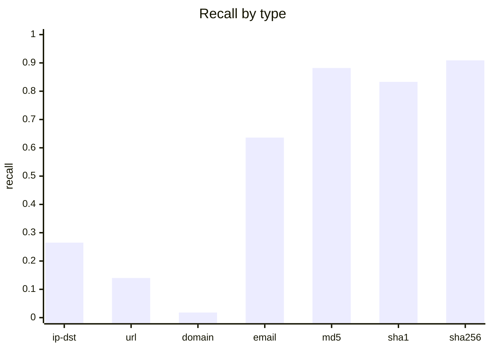
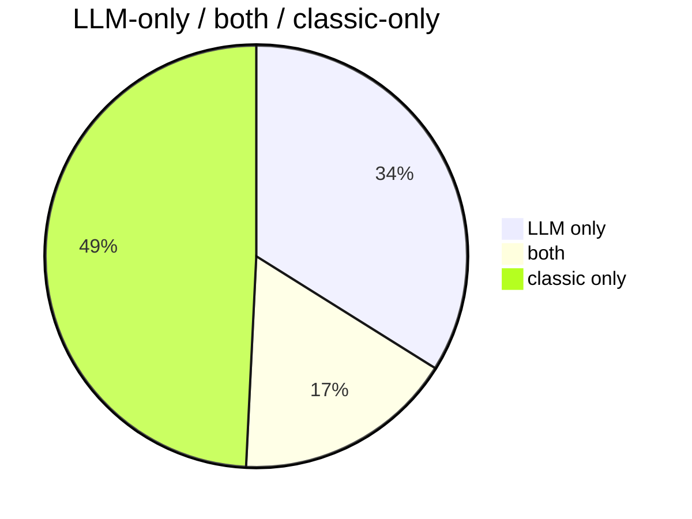
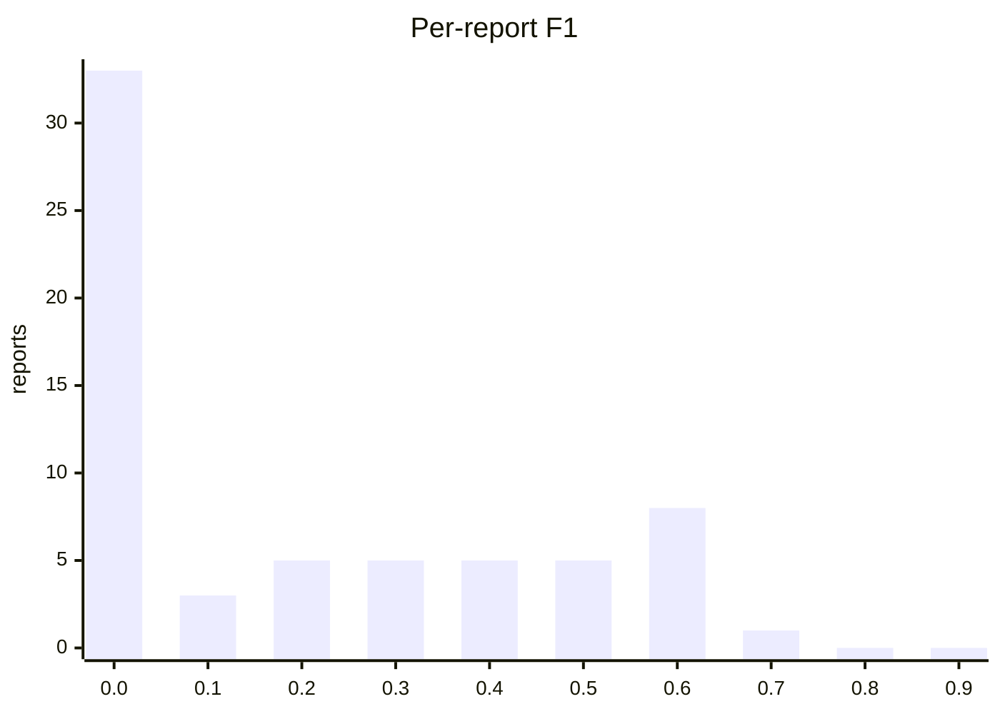

# Extraction benchmark: LLM vs classic regex extractor

Date: 2026-09-05. Sample: seed 42, n 100, reports with
results 100, reports with LLM errors 35.

- Model: `qwen3.8:latest` digest `22130167c4c2` server `ollama 0.33.2`
- Prompt: `cti-info-extraction/qwen3.8-v1` v1 sha256 `9adaea95ee9ed16546dc141da3317b8aec6907dd983d682e92da6be9d1ab0757`
- Classic tool: `iocextract 1.16.1`

**Method.** Indicators are compared by normalised value only (lower-case, trailing `/` and `.`
stripped); types are ignored. The classic extractor is a deliberate *superset* reference (it also
catches defanged values), so an LLM "false positive" is a value the regexes missed and an LLM
"false negative" may be a correct omission (e.g. the reporting vendor's own site). Specificity and
accuracy need a wider universe than `llm ∪ classic` and are only meaningful in the gold view.

## LLM vs classic (65 reports)

### Confusion matrix (micro counts)

|  | classic yes | classic no | total |
|---|---|---|---|
| LLM yes | 120 | 241 | 361 |
| LLM no | 350 | 0 | 350 |
| total | 470 | 241 | 711 |

### Metrics

| metric | micro | macro (mean per report) |
|---|---|---|
| precision | 0.332 | 0.273 |
| recall | 0.255 | 0.213 |
| specificity | 0.000 | 0.000 |
| accuracy | 0.169 | 0.150 |
| f1 | 0.289 | 0.220 |
| jaccard | 0.169 | 0.150 |
| cohen_kappa | -0.671 | -0.348 |

### Recall of classic values by type

| type | classic n | recall |
|---|---|---|
| domain | 112 | 0.018 |
| email | 11 | 0.636 |
| ip-dst | 68 | 0.265 |
| md5 | 17 | 0.882 |
| sha1 | 12 | 0.833 |
| sha256 | 44 | 0.909 |
| url | 207 | 0.140 |


### Agreement



### Per-report F1 histogram



### Reports by recall and precision

```mermaid
quadrantChart
  title Reports by recall (x) and precision (y)
  x-axis "low recall" --> "high recall"
  y-axis "low precision" --> "high precision"
  quadrant-1 agree
  quadrant-2 LLM strict
  quadrant-3 disagree
  quadrant-4 LLM generous
  8e804b2b: [0.000, 0.000]
  d27118be: [0.200, 0.333]
  8cb9ac5c: [0.778, 0.538]
  c9acfc88: [0.182, 0.364]
  d256214e: [0.579, 0.647]
  45f70928: [0.500, 0.600]
  662a629b: [0.000, 0.000]
  f22ca523: [0.000, 0.000]
  0d759389: [0.000, 0.000]
  0173351d: [0.000, 0.000]
  93f7b554: [0.167, 0.333]
  fdb2627c: [0.000, 0.000]
  c143dbde: [0.000, 0.000]
  7d02b3fa: [0.000, 0.000]
  0e1ee8a9: [0.143, 0.250]
  1405a5dc: [0.500, 0.333]
  6cc03d12: [0.000, 0.000]
  68303cde: [0.000, 0.000]
  69b2b5d5: [0.000, 0.000]
  fbb37538: [0.000, 0.000]
  d740af4f: [0.000, 0.000]
  e0234eb8: [0.500, 0.222]
  b376f09a: [0.000, 0.000]
  cc13367a: [0.444, 1.000]
  52cbaed5: [0.000, 0.000]
  4e697d2e: [0.500, 1.000]
  53d99aad: [0.000, 0.000]
  59058517: [0.333, 0.600]
  13edb894: [0.000, 0.000]
  731ff89d: [0.250, 0.667]
  5f36e25e: [0.000, 0.000]
  d1d74b29: [0.750, 0.429]
  536e5094: [0.667, 0.381]
  014c75a7: [0.000, 0.000]
  12b3fde8: [0.000, 0.000]
  40301ca4: [0.000, 0.000]
  bd43481b: [0.000, 0.000]
  20649884: [0.611, 0.524]
  cc825515: [0.571, 0.400]
  6970d678: [0.333, 1.000]
  97271a6a: [0.205, 0.444]
  88425055: [0.000, 0.000]
  7d044e79: [0.000, 0.000]
  428fd94c: [0.000, 0.000]
  43cd6667: [0.000, 0.000]
  881ef0cf: [0.000, 0.000]
  c266b9cf: [0.571, 0.800]
  c58b4df0: [0.333, 0.111]
  9fcc0e30: [0.091, 0.333]
  226d6c53: [0.400, 0.286]
  5ffd1c8b: [0.000, 0.000]
  64b77888: [0.000, 0.000]
  d43f68c1: [0.250, 0.750]
  e0f1ad2e: [0.294, 0.526]
  a9b8e5c7: [0.500, 0.500]
  79a42502: [0.500, 1.000]
  c91d14a0: [0.333, 0.500]
  94486493: [0.000, 0.000]
  4c375f8c: [0.000, 0.000]
  2dd4dea5: [0.889, 0.667]
```

### Indicator counts per extractor

```mermaid
xychart-beta
  title "Indicators per type"
  x-axis ["ip-dst", "url", "domain", "email", "md5", "sha1", "sha256"]
  y-axis "classic / llm" 0 --> 208
  bar [68, 208, 112, 11, 20, 12, 44]
  bar [16, 31, 27, 0, 15, 10, 40]
```



### Per report

| id | title | classic n | llm n | tp | fp | fn | precision | recall | f1 | kappa | seconds |
|---|---|---|---|---|---|---|---|---|---|---|---|
| 8e804b2b-e84d-4eb4-b6ca-d4b0fdb21aee | With Upgrades in Delivery and Support In | 6 | 5 | 0 | 5 | 6 | 0.000 | 0.000 | 0.000 | -0.984 | 21.342 |
| d27118be-8a8f-4660-994e-7450c6d80ab1 | A Pretty Dope Story About Bears: Early I | 5 | 3 | 1 | 2 | 4 | 0.333 | 0.200 | 0.250 | -0.615 | 12.029 |
| 8cb9ac5c-b5dd-45a5-80d9-56dbdacdbc5a | Operation Bleeding Bear | 9 | 13 | 7 | 6 | 2 | 0.538 | 0.778 | 0.636 | -0.250 | 39.176 |
| c9acfc88-6f0e-4ded-94f3-8e6985871d86 | 2021-11-02 - Underminer Exploit Kit- The | 22 | 11 | 4 | 7 | 18 | 0.364 | 0.182 | 0.242 | -0.533 | 44.689 |
| d256214e-8231-4909-91e7-e2dfbe7f31f4 | 2017-07-24 - Real News, Fake Flash- Mac  | 19 | 17 | 11 | 6 | 8 | 0.647 | 0.579 | 0.611 | -0.378 | 40.181 |
| 45f70928-55c0-4208-9f4e-75c1a1ba1d26 | 2010-03-07 - March 2010 Opachki Trojan u | 6 | 5 | 3 | 2 | 3 | 0.600 | 0.500 | 0.545 | -0.429 | 22.600 |
| 662a629b-5164-483c-acf3-7741fd42edb5 | IssueMakersLab - Cyber Warfare Research  | 22 | 0 | 0 | 0 | 22 | 0.000 | 0.000 | 0.000 | 0.000 | 17.325 |
| f22ca523-b736-4340-9ed2-bacc2a123910 | Secure Communications Blog | 2 | 0 | 0 | 0 | 2 | 0.000 | 0.000 | 0.000 | 0.000 | 3.916 |
| 0d759389-9c2f-45fc-9e94-7fe3617ce50b | 2017-10-13 - FIN7 Dissected- Hackers Acc | 0 | 2 | 0 | 2 | 0 | 0.000 | 0.000 | 0.000 | 0.000 | 3.863 |
| 0173351d-ecc3-4815-a3ad-05720e6d7773 | Chafer: Latest Attacks Reveal Heightened | 36 | 7 | 0 | 7 | 36 | 0.000 | 0.000 | 0.000 | -0.375 | 48.283 |
| 93f7b554-a14b-46a5-8c6a-612fec57668b | 2020-10-11 - Chimera, APT19 under the ra | 6 | 3 | 1 | 2 | 5 | 0.333 | 0.167 | 0.222 | -0.556 | 13.854 |
| fdb2627c-d5dc-4601-bfbe-bf446e27ba17 | Treasury Sanctions China-based Hacker In | 2 | 8 | 0 | 8 | 2 | 0.000 | 0.000 | 0.000 | -0.471 | 13.054 |
| c143dbde-a82b-46b6-9bfe-21c8c18905e7 | HP_Bromium_Threat_Insights_Report_Q4_202 | 33 | 2 | 0 | 2 | 33 | 0.000 | 0.000 | 0.000 | -0.121 | 10.512 |
| 7d02b3fa-342e-4857-b094-85c65c96779c | New threat actor, UAT-9921, leverages Vo | 2 | 5 | 0 | 5 | 2 | 0.000 | 0.000 | 0.000 | -0.690 | 12.861 |
| 0e1ee8a9-df19-40ed-b899-4e825353b0e6 | 2017-11-15 - New EMOTET Hijacks a Window | 21 | 12 | 3 | 9 | 18 | 0.250 | 0.143 | 0.182 | -0.667 | 39.044 |
| 1405a5dc-c3f2-4f58-8c62-46c8367e62f0 | Authorities confirm RagnarLocker ransomw | 2 | 3 | 1 | 2 | 1 | 0.333 | 0.500 | 0.400 | -0.500 | 47.305 |
| 6cc03d12-f2bd-4227-aca9-882cf2deed9d | New Apple Mac Trojan Called OSX/Crisis D | 4 | 2 | 0 | 2 | 4 | 0.000 | 0.000 | 0.000 | -0.800 | 54.091 |
| 68303cde-3001-483f-837d-4571efae2158 | 1,400 Pegasus spyware infections detaile | 2 | 2 | 0 | 2 | 2 | 0.000 | 0.000 | 0.000 | -1.000 | 6.642 |
| 69b2b5d5-53fd-46c9-95de-dd95527a8649 | 2020-12-02 - ‘Shadow Academy’ Targets 20 | 1 | 6 | 0 | 6 | 1 | 0.000 | 0.000 | 0.000 | -0.324 | 12.629 |
| fbb37538-3879-45ae-980e-a549a3f54d9b | Censys Blog | Cybersecurity Insights & T | 3 | 0 | 0 | 0 | 3 | 0.000 | 0.000 | 0.000 | 0.000 | 3.549 |
| d740af4f-cd35-4cc9-a33b-4cf450aaf816 | Enabling or disabling Lockdown mode on a | 2 | 0 | 0 | 0 | 2 | 0.000 | 0.000 | 0.000 | 0.000 | 3.409 |
| e0234eb8-0ea8-4087-87e7-7aa11fcacd46 | Passive Income of Cyber Criminals: Disse | 5 | 9 | 2 | 7 | 2 | 0.222 | 0.500 | 0.308 | -0.394 | 20.489 |
| b376f09a-1824-4881-8847-35d66d236ba2 | Advisories are published, but are enough | 2 | 5 | 0 | 5 | 2 | 0.000 | 0.000 | 0.000 | -0.690 | 8.066 |
| cc13367a-315e-4d21-9ebf-184092d35371 | Enterprise Scale Threat Hunting: C2 Beac | 9 | 4 | 4 | 0 | 5 | 1.000 | 0.444 | 0.615 | 0.000 | 8.593 |
| 52cbaed5-b357-4ba4-949f-9b846045446a | 2020-04-08 - How Cyber Adversaries are A | 0 | 24 | 0 | 24 | 0 | 0.000 | 0.000 | 0.000 | 0.000 | 37.651 |
| 4e697d2e-8ecf-4947-b43e-2c18b8298aa8 | Adobe To Announce Source Code, Customer  | 2 | 1 | 1 | 0 | 1 | 1.000 | 0.500 | 0.667 | 0.000 | 5.127 |
| 53d99aad-54d9-44f7-9161-f4346320da12 | CAPEC-163: Spear Phishing (Version 3.9) | 2 | 2 | 0 | 2 | 2 | 0.000 | 0.000 | 0.000 | -1.000 | 12.497 |
| 59058517-476f-42b7-a8ff-6b06b85e1c4d | 2021-06-17 - New TA402 Molerats Malware  | 18 | 10 | 6 | 4 | 12 | 0.600 | 0.333 | 0.429 | -0.375 | 48.071 |
| 13edb894-84e6-4415-ba72-43c6d5cd4da9 | 2009-08-05 - PC Users Threatened by Conf | 0 | 8 | 0 | 8 | 0 | 0.000 | 0.000 | 0.000 | 0.000 | 12.613 |
| 731ff89d-2473-41f6-a29a-10a7b1a21221 | New “CleverSoar” Installer Targets Chine | 8 | 3 | 2 | 1 | 6 | 0.667 | 0.250 | 0.364 | -0.235 | 11.074 |
| 5f36e25e-4cfd-4cc8-8476-8a21405a80cc | Web skimmers found on the websites of In | 2 | 1 | 0 | 1 | 2 | 0.000 | 0.000 | 0.000 | -0.800 | 4.593 |
| d1d74b29-dfae-465f-bde6-95e3789d35c5 | Nobelium Returns to the Political World  | 5 | 7 | 3 | 4 | 1 | 0.429 | 0.750 | 0.545 | -0.250 | 23.630 |
| 536e5094-0063-4752-8c4f-492ae30c636d | Gamaredon group grows its game | 12 | 21 | 8 | 13 | 4 | 0.381 | 0.667 | 0.485 | -0.324 | 50.295 |
| 014c75a7-0397-46b8-a722-f3cdca20a203 | US aerospace services provider breached  | 2 | 6 | 0 | 6 | 2 | 0.000 | 0.000 | 0.000 | -0.600 | 11.456 |
| 12b3fde8-4bca-4a69-a632-c4fbb17388ea | SonicALERT: CVE 2014-0322 Malware - Saku | 2 | 3 | 0 | 3 | 2 | 0.000 | 0.000 | 0.000 | -0.923 | 8.265 |
| 40301ca4-fed9-4b59-95ba-b668eb8eb7aa | 2018-11-27 - Meet CrowdStrike’s Adversar | 0 | 8 | 0 | 8 | 0 | 0.000 | 0.000 | 0.000 | 0.000 | 12.432 |
| bd43481b-2327-459f-b28d-2190e5c53c2e | LAPSUS$: Recent techniques, tactics and  | 9 | 0 | 0 | 0 | 9 | 0.000 | 0.000 | 0.000 | 0.000 | 9.791 |
| 20649884-ffe0-4fa6-aa3a-6e4e28d041c8 | North Korean hackers are skimming US and | 18 | 21 | 11 | 10 | 7 | 0.524 | 0.611 | 0.564 | -0.417 | 42.505 |
| cc825515-25a8-40ef-8eb0-fc8647a2a6fc | 2022-08-25 - New Golang Ransomware Agend | 7 | 10 | 4 | 6 | 3 | 0.400 | 0.571 | 0.471 | -0.444 | 37.204 |
| 6970d678-af35-45eb-a737-ae6dff7f95bb | Yokogawa announcement warns of counterfe | 3 | 1 | 1 | 0 | 2 | 1.000 | 0.333 | 0.500 | 0.000 | 4.722 |
| 97271a6a-85e2-4e34-afd8-4ef4fcea8001 | Probable Iranian Cyber Actors, Static Ki | 39 | 18 | 8 | 10 | 31 | 0.444 | 0.205 | 0.281 | -0.446 | 43.432 |
| 88425055-d1e5-4ee5-99fc-9da64837161d | Equinix data center giant hit by Netwalk | 4 | 3 | 0 | 3 | 4 | 0.000 | 0.000 | 0.000 | -0.960 | 7.350 |
| 7d044e79-5cff-47b3-a06d-71ba997d3aa0 | 2022-01-21 - A deeper UEFI dive into Moo | 2 | 3 | 0 | 3 | 2 | 0.000 | 0.000 | 0.000 | -0.923 | 11.528 |
| 428fd94c-4beb-4216-9997-9b9aaf872b21 | Threat Analysis: Active C2 Discovery Usi | 8 | 3 | 0 | 3 | 8 | 0.000 | 0.000 | 0.000 | -0.658 | 14.406 |
| 43cd6667-c47f-4b9c-a2be-acc4d152d63d |  | 0 | 1 | 0 | 1 | 0 | 0.000 | 0.000 | 0.000 | 0.000 | 4.326 |
| 881ef0cf-5e33-418f-96ce-f36b5e5525dd | 2021-04-12 - A chat with DarkSide | 0 | 1 | 0 | 1 | 0 | 0.000 | 0.000 | 0.000 | 0.000 | 8.212 |
| c266b9cf-17a6-4cfc-b6a2-c5544aa8bf9b | Daxin Backdoor: In-Depth Analysis, Part  | 7 | 5 | 4 | 1 | 3 | 0.800 | 0.571 | 0.667 | -0.231 | 14.339 |
| c58b4df0-ab21-460e-adbf-23c5c8b30ccd | FBI seize BreachForums hacking forum use | 3 | 9 | 1 | 8 | 2 | 0.111 | 0.333 | 0.167 | -0.410 | 22.857 |
| 9fcc0e30-0309-40cc-be0e-424d0185f335 | Parrot TDS takes over web servers and th | 11 | 3 | 1 | 2 | 10 | 0.333 | 0.091 | 0.143 | -0.345 | 9.668 |
| 226d6c53-ef8e-455b-bb6f-48058bf96635 | 2014-05-13 - Cat Scratch Fever- CrowdStr | 5 | 8 | 2 | 5 | 3 | 0.286 | 0.400 | 0.333 | -0.600 | 17.909 |
| 5ffd1c8b-ea76-4a97-959a-8a6601dd0f73 | 2021-10-21 - Cobalt Strike- Using Known  | 0 | 2 | 0 | 2 | 0 | 0.000 | 0.000 | 0.000 | 0.000 | 5.489 |
| 64b77888-2d30-48e2-80c2-6b0b9a254db5 | 2020-12-15 - Removing Coordinated Inauth | 0 | 2 | 0 | 2 | 0 | 0.000 | 0.000 | 0.000 | 0.000 | 10.115 |
| d43f68c1-fcde-4481-92f9-920a2509a249 | CVE-2022-23812 | RIAEvangelist/node-ipc  | 12 | 4 | 3 | 1 | 9 | 0.750 | 0.250 | 0.375 | -0.161 | 13.073 |
| e0f1ad2e-49e3-4f62-8c33-9754426b1b27 | Blackhole Ramnit - samples and analysis | 37 | 19 | 10 | 9 | 24 | 0.526 | 0.294 | 0.377 | -0.438 | 41.119 |
| a9b8e5c7-a287-40f9-bf3a-1e188b94cee5 | Important Detection and Remediation Acti | 2 | 2 | 1 | 1 | 1 | 0.500 | 0.500 | 0.500 | -0.500 | 6.117 |
| 79a42502-2174-4138-9838-715426a8e449 | Some notes on IoCs | 2 | 1 | 1 | 0 | 1 | 1.000 | 0.500 | 0.667 | 0.000 | 4.588 |
| c91d14a0-dd48-4b5c-92e5-c602bde66e1c | ZIP files, make it bigger to avoid EDR d | 3 | 2 | 1 | 1 | 2 | 0.500 | 0.333 | 0.400 | -0.500 | 5.709 |
| 94486493-db69-494a-9eba-157c17bc0127 | Research, News, and Perspectives | 2 | 0 | 0 | 0 | 2 | 0.000 | 0.000 | 0.000 | 0.000 | 3.515 |
| 4c375f8c-a405-4927-930c-97fdfd69e972 | 2021-11-18 - Two Iranian Nationals Charg | 0 | 2 | 0 | 2 | 0 | 0.000 | 0.000 | 0.000 | 0.000 | 10.183 |
| 2dd4dea5-a859-4ba4-b25c-ce158e084017 | 2020-11-18 - Business as usual- Criminal | 9 | 12 | 8 | 4 | 1 | 0.667 | 0.889 | 0.762 | -0.140 | 44.203 |
| 283b3f32-ea0a-4e05-b871-556307952612 | Cloud Security - Palo Alto Networks Blog | 2 | 0 | 0 | 0 | 2 | 0.000 | 0.000 | 0.000 | 0.000 | 6.876 |
| e60bcd10-a59d-4e73-8764-e5eb716bced7 | 2022-12-20 - Lazarus APT’s Operation Int | 2 | 5 | 1 | 4 | 1 | 0.200 | 0.500 | 0.286 | -0.364 | 9.386 |
| 114744a5-256d-45fc-b95c-bb0b68619145 | 2020-05-04 - ATM malware targets Wincor  | 4 | 2 | 2 | 0 | 2 | 1.000 | 0.500 | 0.667 | 0.000 | 7.890 |
| 00414a04-1453-42cd-ae50-42c2a761b837 | SoumniBot: the new Android banker’s uniq | 8 | 4 | 4 | 0 | 4 | 1.000 | 0.500 | 0.667 | 0.000 | 13.990 |
| eda4d990-63ba-47a8-90fc-1cbcea0f8d06 | Windows PWDUMP tools | 2 | 1 | 0 | 1 | 2 | 0.000 | 0.000 | 0.000 | -0.800 | 5.713 |

## Deviations

### LLM-only values (what the regexes missed), top 50

| id | type | value |
|---|---|---|
| 8e804b2b | domain | blogspot.com |
| 8e804b2b | filename | 29[.]html |
| 8e804b2b | filename | blog-page[.]html |
| 8e804b2b | filename | mshta.exe |
| 8e804b2b | malware-type | Revenge RAT |
| d27118be | threat-actor | APT28 |
| d27118be | threat-actor | Fancy Bear |
| 8cb9ac5c | btc | 1AVNM68gj6PGPFcJuftKATa4WLnzg8fpfv |
| 8cb9ac5c | filename | AdvancedRun.exe |
| 8cb9ac5c | filename | InstallUtil.exe |
| 8cb9ac5c | filename | Nmddfrqqrbyjeygggda.vbs |
| 8cb9ac5c | filename | stage1.exe |
| 8cb9ac5c | filename | stage2.exe |
| c9acfc88 | filename | Licencing.exe |
| c9acfc88 | filename | Licensing.exe |
| c9acfc88 | filename | dllhost.exe |
| c9acfc88 | filename | ic.exe |
| c9acfc88 | filename | vt.zip |
| c9acfc88 | regkey | HKCU\Software\Microsoft\Windows\CurrentVersion\Explorer\User Shell Folders |
| c9acfc88 | regkey | HKCU\Software\Microsoft\Windows\CurrentVersion\Run |
| d256214e | filename | GetFlashPlayer |
| d256214e | filename | GetFlashPlayer.zip |
| d256214e | filename | com.GetFlashPlayer.plist |
| d256214e | ip-dst | 185.28.22.22 |
| d256214e | malware-type | OSX/Leverage.A |
| d256214e | threat-actor | aleks papandopulo |
| 45f70928 | filename | dropper.exe |
| 45f70928 | filename | rundll32.dll |
| 0d759389 | threat-actor | Carbanak Gang |
| 0d759389 | threat-actor | FIN7 |
| 0173351d | filename | Y658123.vbs |
| 0173351d | malware-type | Backdoor.Remexi |
| 0173351d | malware-type | Hacktool.Mimikatz |
| 0173351d | malware-type | Pwdump |
| 0173351d | threat-actor | Chafer |
| 0173351d | threat-actor | Crambus |
| 0173351d | threat-actor | Oilrig |
| 93f7b554 | threat-actor | APT19 |
| 93f7b554 | threat-actor | Chimera |
| fdb2627c | threat-actor | Flax Typhoon |
| fdb2627c | threat-actor | Integrity Technology Group, Inc. |
| fdb2627c | threat-actor | Salt Typhoon |
| fdb2627c | threat-actor | Shanghai Heiying Information Technology Company, Limited |
| fdb2627c | threat-actor | Sichuan Juxinhe Network Technology Company, Ltd. |
| fdb2627c | threat-actor | Sichuan Silence Information Technology Company, Ltd. |
| fdb2627c | threat-actor | Yin Kecheng |
| fdb2627c | threat-actor | Zhou Shuai |
| c143dbde | vulnerability | CVE-2017-0199 |
| c143dbde | vulnerability | CVE-2017-11882 |
| 7d02b3fa | malware-type | VoidLink |

### Classic-only values (what the LLM left out), first 10 per type

reporter-domain: 78, other: 273 (of 351 classic-only values)

| id | type | value | flag |
|---|---|---|---|
| 8e804b2b | domain | web.archive.org | reporter-domain |
| 8cb9ac5c | domain | www.elastic.co | reporter-domain |
| c9acfc88 | domain | intel471.com |  |
| c9acfc88 | domain | socprime.com |  |
| c9acfc88 | domain | www.aldeid.com |  |
| c9acfc88 | domain | www.bleepingcomputer.com |  |
| c9acfc88 | domain | www.trendmicro.com |  |
| d256214e | domain | get.adobe.com |  |
| d256214e | domain | updatesec.webredirect.org |  |
| 45f70928 | domain | www.threatexpert.com |  |
| fbb37538 | email | connect@censys.com | reporter-domain |
| 9fcc0e30 | email | ti@avast.com |  |
| 226d6c53 | email | intelligence@crowdstrike.com |  |
| e0f1ad2e | email | contact@privacyprotect.org |  |
| c9acfc88 | ip-dst | 169.197.142.162 |  |
| c9acfc88 | ip-dst | 194.124.213.221 |  |
| d256214e | ip-dst | 176.9.0.0 |  |
| d256214e | ip-dst | 213.200.0.0 |  |
| d256214e | ip-dst | 45.77.52.0 |  |
| 0173351d | ip-dst | 107.191.62.45 |  |
| 0173351d | ip-dst | 134.119.217.84 |  |
| 0173351d | ip-dst | 148.251.197.113 |  |
| 0173351d | ip-dst | 185.22.172.40 |  |
| 0173351d | ip-dst | 83.142.230.113 |  |
| d43f68c1 | md5 | ae511e1627824a968aaaa758a5309154 |  |
| d43f68c1 | md5 | f7ae3457420af78a54b38a31cc0c809c |  |
| d43f68c1 | sha1 | 6e344066a0464814a27fbd7ca8422f473956a803 |  |
| d43f68c1 | sha1 | 847047cf7f81ab08352038b2204f0e7633449580 |  |
| 59058517 | sha256 | 6d65804ca8f71e21b18de08176a53d8f203bc23629dd822ef3c0da217f95f119 |  |
| e0f1ad2e | sha256 | a40aacca731c142148733786cae64d45df2e740e3fb744ffc513d251ec121cf7 |  |
| e0f1ad2e | sha256 | c1293f8dd8a243391d087742fc22c99b8263f70c6937f784c15e9e20252b38ae |  |
| e0f1ad2e | sha256 | f52bfac9637aea189ec918d05113c36f5bcf580f3c0de8a934fe3438107d3f0c |  |
| 8e804b2b | url | http:29.html |  |
| 8e804b2b | url | http:blog-page.html |  |
| 8e804b2b | url | http:blogspot.com |  |
| 8e804b2b | url | https://web.archive.org/web/20200428173819/https://cofense.com/upgrades-delivery-support-infrastructure-revenge-rat-malware-bigg | reporter-domain |
| 8e804b2b | url | https://web.archive.org/web/20200428173819/https://cofense.com/upgrades-delivery-support-infrastructure-revenge-rat-malware-bigger-threat/ | reporter-domain |
| d27118be | url | http:dopingagency.com |  |
| d27118be | url | http:mail.dopingagency.com |  |
| d27118be | url | http:mail.worlddopingagency.com |  |
| d27118be | url | http:worlddopingagency.com |  |
| 8cb9ac5c | url | https://www.elastic.co/fr/security-labs/operation-bleeding-bear | reporter-domain |

### LLM rejection reasons (summed over reports)

| reason | count |
|---|---|
| format | 76 |
| confidence | 13 |
| not-in-source | 10 |
| quote-mismatch | 3 |

## Gold view (3 hand-labelled reports)

Universe = classic ∪ llm ∪ gold per report, so tn, specificity and accuracy are meaningful.

| report | pair | tp | fp | fn | tn | precision | recall | specificity | accuracy | f1 | jaccard | kappa |
|---|---|---|---|---|---|---|---|---|---|---|---|---|
| 10a94632 | llm vs gold | 0 | 0 | 0 | 4 | 1.000 | 1.000 | 1.000 | 1.000 | 1.000 | 1.000 | 1.000 |
| 10a94632 | classic vs gold | 0 | 4 | 0 | 0 | 0.000 | 0.000 | 0.000 | 0.000 | 0.000 | 0.000 | 0.000 |
| 59ed4725 | llm vs gold | 13 | 0 | 6 | 57 | 1.000 | 0.684 | 1.000 | 0.921 | 0.812 | 0.684 | 0.765 |
| 59ed4725 | classic vs gold | 6 | 57 | 13 | 0 | 0.095 | 0.316 | 0.000 | 0.079 | 0.146 | 0.079 | -0.386 |
| orkl-sam | llm vs gold | 15 | 0 | 1 | 4 | 1.000 | 0.938 | 1.000 | 0.950 | 0.968 | 0.938 | 0.857 |
| orkl-sam | classic vs gold | 11 | 4 | 5 | 0 | 0.733 | 0.688 | 0.000 | 0.550 | 0.710 | 0.550 | -0.286 |
| micro | llm vs gold | 28 | 0 | 7 | 65 | 1.000 | 0.800 | 1.000 | 0.930 | 0.889 | 0.800 | 0.839 |
| micro | classic vs gold | 17 | 65 | 18 | 0 | 0.207 | 0.486 | 0.000 | 0.170 | 0.291 | 0.170 | -0.393 |

### Cohen's kappa

| report | LLM–gold | classic–gold | LLM–classic |
|---|---|---|---|
| 10a94632 | 1.000 | 0.000 | 0.000 |
| 59ed4725 | 0.765 | -0.386 | -0.359 |
| orkl-sam | 0.857 | -0.286 | -0.067 |

## Reproduce

```bash
python -m benchmarks.orkl --n 100 --seed 42
python -m genai.classic benchmarks/data/orkl/*.json -o benchmarks/results
python -m benchmarks.run_llm
python -m benchmarks.compare --data-dir benchmarks/data/orkl --results-dir benchmarks/results --out docs/BENCHMARKS_extraction.md --csv benchmarks/results/extraction.csv
```
