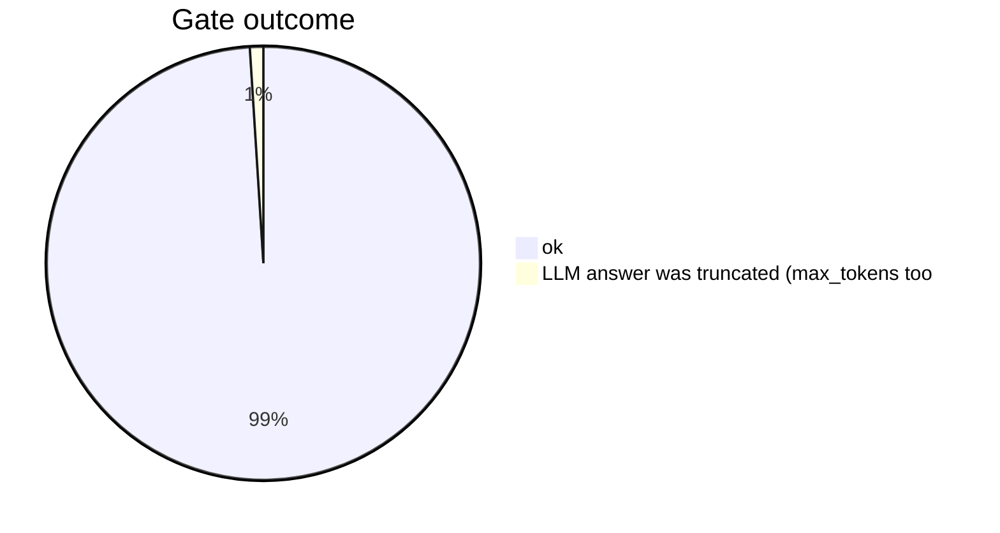
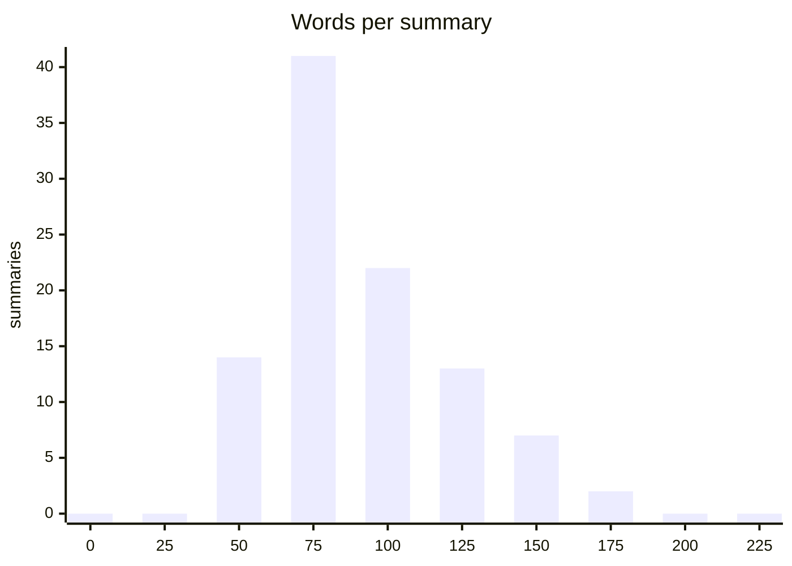

# Summarization benchmark: summary_kind=event

Date: 2026-09-05. Reports: 100, summaries: 99, errors: 1.

- Model: `qwen3.8:latest` digest `22130167c4c2` server `ollama 0.33.2`
- Prompt: `summary-event/qwen3.8-v2` v2 sha256 `7194f5dff1341991f59bd1caa2926bf82ed8d115868e04cf8da1ec4a5280cda4`; headings ['## What happened', '## Key indicators', '## Context and attribution', '## Related events']; max words 200

**Method.** No reference summaries exist, so this measures the module's own gate (headings, length, no indicator that is not in the input), length, how much of the event's own hashes/IPs/URLs the summary mentions (coverage, informational: a good summary need not list every hash), timing, and determinism between two passes with the same seed (byte-identical, and word-level similarity otherwise).

## Gate

| outcome / gate problem (one error can carry several) | count |
|---|---|
| summary produced | 99 |
| LLM answer was truncated (max_tokens too | 1 |



## Length (words, headings excluded by the gate; limit 200)

| min | median | p90 | max |
|---|---|---|---|
| 61 | 95 | 147 | 179 |



## Headings present

| heading | summaries |
|---|---|
| ## What happened | 99 |
| ## Key indicators | 99 |
| ## Context and attribution | 99 |
| ## Related events | 99 |

## Indicator coverage (share of the reference md5/sha1/sha256/ip-dst/url mentioned)

| reports with indicators | mean coverage | median |
|---|---|---|
| 80 | 0.540 | 0.500 |

## Timing

| median s | p90 s | max s | total min |
|---|---|---|---|
| 5.262 | 7.740 | 14.190 | 9.182 |

## Determinism (second pass, same seed and temperature 0)

| paired | byte-identical | mean word similarity | min similarity |
|---|---|---|---|
| 99 | 99 | 1.000 | 1.000 |

## Per report

| id | title | status | words | coverage | seconds | identical | similarity |
|---|---|---|---|---|---|---|---|
| 03488f3d | DigitalSide Malware report: MD5: af5e5b2 | ok | 109 | 0.231 | 5.394 | True | 1.000 |
| 0c4cb36b | Malware collection | ok | 70 | 0.750 | 3.640 | True | 1.000 |
| 0d2fc4a8 | Redis bruteforce Attackers [2024-07-17] | ok | 72 |  | 4.780 | True | 1.000 |
| 0ef83690 | DigitalSide Malware report: MD5: fe34555 | ok | 102 | 0.800 | 6.848 | True | 1.000 |
| 0fe4fcd5 | DigitalSide Malware report: MD5: 15ca693 | ok | 116 | 0.800 | 6.194 | True | 1.000 |
| 1557a21b | Agent Tesla - javascript dropper - SMTP  | ok | 134 | 0.333 | 5.249 | True | 1.000 |
| 1699737c | AlienVault | Backdoored PHP Software | ok | 90 | 0.102 | 4.219 | True | 1.000 |
| 21d28baf | Honeytrap | ok | 73 |  | 4.853 | True | 1.000 |
| 229a6cc8 | Remcos host indicators [2023-09-12] | ok | 95 | 0.278 | 5.646 | True | 1.000 |
| 264575d2 | ThreatFox IOCs for 2024-04-12 | ok | 122 | 0.000 | 11.645 | True | 1.000 |
| 26d4048d | Dionaea | ok | 79 |  | 3.541 | True | 1.000 |
| 2a330185 | AlienVault | New modular downloaders fin | ok | 142 | 0.263 | 7.857 | True | 1.000 |
| 2cfaae22 | AlienVault | Carbanak attacks against Ch | ok | 94 | 0.556 | 4.600 | True | 1.000 |
| 2d6a7f33 | AgentTesla downloaded from a .js file (S | ok | 147 | 0.364 | 5.933 | True | 1.000 |
| 2eef230e | Cowrie | ok | 69 |  | 2.698 | True | 1.000 |
| 30dbf7d0 | Unveiling the Weaponized Web Shell Encys | ok | 114 |  | 4.200 | True | 1.000 |
| 317f3edc | Storm-1175 focuses gaze on vulnerable we | ok | 179 | 0.556 | 6.632 | True | 1.000 |
| 31a5a558 | Telnet bruteforce Attackers [2024-01-25] | ok | 79 |  | 6.954 | True | 1.000 |
| 361b5b3e | Formbook host indicators [2024-07-02] | ok | 93 | 0.278 | 5.314 | True | 1.000 |
| 3cc0969a | Telnet bruteforce Attackers [2024-03-07] | ok | 85 |  | 6.356 | True | 1.000 |
| 44146c5a | RDP bruteforce Attackers [2022-08-10] | ok | 80 |  | 7.112 | True | 1.000 |
| 4bf84caa | DigitalSide Malware report: MD5: ac06141 | ok | 99 | 0.286 | 4.580 | True | 1.000 |
| 4e1b163a | "Subject: [REDACTED] will be Disabled ,  | ok | 98 | 1.000 | 4.165 | True | 1.000 |
| 4f937fac | "Subject: RE: SHIPPING DOC - From: chenh | ok | 91 |  | 4.088 | True | 1.000 |
| 4ff7ce39 | Nuevo Backdoor en Outlook Atribuido a AP | ok | 104 | 1.000 | 5.240 | True | 1.000 |
| 5302ad3a | Detecting Linux Variants of Interlock Ra | ok | 129 | 1.000 | 5.759 | True | 1.000 |
| 56e1af4c | 0076e384e324fbb55fcb9d42b0ce281c | ok | 87 | 1.000 | 4.046 | True | 1.000 |
| 56e1b16a | 01ada39c547ab3b4c5bc811203caa493 | ok | 61 | 1.000 | 3.483 | True | 1.000 |
| 57615970 | Targeted attack against DNC | ok | 117 | 0.263 | 4.331 | True | 1.000 |
| 580f6d79 | Locky 2016-10-25 : Affid=3, DGA=88822 -  | ok | 129 | 0.038 | 7.740 | True | 1.000 |
| 587940d2 | Lokibot host indicators [2024-12-09] | ok | 79 | 0.556 | 4.419 | True | 1.000 |
| 589a41fb | Cerber delivered via malicious Office do | ok | 76 | 1.000 | 4.082 | True | 1.000 |
| 58b8193a | Reversing malware in a custom format_ Hi | ok | 65 | 1.000 | 4.275 | True | 1.000 |
| 591b7178 | Formbook host indicators [2024-05-22] | ok | 128 | 0.098 | 8.009 | True | 1.000 |
| 59aaa45d | Active ransomware attack uses impersonat | ok | 89 | 1.000 | 3.932 | True | 1.000 |
| 5a24041c | OSINT - Android Malware Appears Linked t | ok | 144 | 0.176 | 4.991 | True | 1.000 |
| 5a26b608 | M2M - "..doc" 2017-11-30 : "FL-123456 11 | ok | 129 | 0.138 | 7.144 | True | 1.000 |
| 5b6952a8 | DigitalSide Malware report: MD5: d90b513 | ok | 91 | 1.000 | 4.537 | True | 1.000 |
| 5b6ab2dc | "Zestawieni VAT-08/ZUS-08" Campaign | ok | 73 | 1.000 | 3.975 | True | 1.000 |
| 5c4970b2 | emotet IOC update | ok | 102 | 0.625 | 5.572 | True | 1.000 |
| 5c51a54e | OSINT: Excel 4.0 Macro Utilized by TA505 | ok | 176 | 0.056 | 10.690 | True | 1.000 |
| 5c55ff39 | emotet IOC update | ok | 100 | 0.444 | 5.527 | True | 1.000 |
| 5c65d32b | emotet IOC update | ok | 100 | 0.500 | 5.188 | True | 1.000 |
| 5c6d7d5f | c2 endpoint delta | ok | 70 | 1.000 | 4.138 | True | 1.000 |
| 5c6db438 | emotet IOC update | ok | 89 | 1.000 | 4.338 | True | 1.000 |
| 5c6dfe96 | c2 endpoint delta | ok | 76 | 0.104 | 4.548 | True | 1.000 |
| 5c974ce1 | emotet IOC update | ok | 89 | 0.122 | 6.001 | True | 1.000 |
| 5ca43fed | emotet IOC update | ok | 85 | 0.023 | 10.593 | True | 1.000 |
| 5d8f6b9e | emotet IOC update | ok | 96 | 0.104 | 7.159 | True | 1.000 |
| 5dc46103 | emotet IOC update | ok | 102 | 0.063 | 7.366 | True | 1.000 |
| 5dd58352 | emotet IOC update | ok | 121 | 0.060 | 7.239 | True | 1.000 |
| 5dea53aa | c2 endpoint delta | ok | 103 | 1.000 | 4.403 | True | 1.000 |
| 5e207470 | emotet IOC update | ok | 84 | 0.417 | 5.322 | True | 1.000 |
| 5e2890cc | emotet exe 5-tuple | ok | 71 | 1.000 | 3.958 | True | 1.000 |
| 5e3008c1 | Nice Try: 501 (Ransomware) Not Implement | ok | 95 | 0.333 | 3.607 | True | 1.000 |
| 5e37c8d1 | emotet IOC update | ok | 79 | 1.000 | 4.779 | True | 1.000 |
| 5e65434b | UPDATE binary C2 additions | ok | 97 |  | 5.318 | True | 1.000 |
| 5f0ee937 | UPDATE binary C2 additions | ok | 112 |  | 5.010 | True | 1.000 |
| 5f13849e | DigitalSide Malware report: MD5: b1a1bcb | ok | 113 | 0.800 | 6.036 | True | 1.000 |
| 5f15a68b | emotet IOC update | ok | 65 | 0.179 | 4.977 | True | 1.000 |
| 5f15caee | emotet exe 5-tuple | ok | 72 | 1.000 | 4.048 | True | 1.000 |
| 7082388a | SSH bruteforce Attackers [2026-08-14] | ok | 84 |  | 6.477 | True | 1.000 |
| 719d64ec | ATR_82599 | ok | 109 | 0.667 | 3.943 | True | 1.000 |
| 71ee28a1 | DigitalSide Malware report: MD5: 22faf22 | ok | 118 | 1.000 | 6.041 | True | 1.000 |
| 7ef5c2f6 | SSH bruteforce Attackers [2025-03-09] | ok | 80 |  | 14.190 | True | 1.000 |
| 813bc4df | Tibet Lurk | ok | 84 | 0.750 | 3.112 | True | 1.000 |
| 84248423 | AlienVault | ChinaZ Updates Toolkit by I | ok | 101 | 0.500 | 5.290 | True | 1.000 |
| 85b11f6b | njRAT host indicators [2024-02-21] | ok | 98 | 0.333 | 4.754 | True | 1.000 |
| 9a50d10e | AgentTesla in ISO mail attachment (SMTP  | ok | 61 | 0.333 | 3.485 | True | 1.000 |
| a8e25d5c | AlienVault | Parallax RAT sample CoronaV | ok | 125 | 1.000 | 5.098 | True | 1.000 |
| a9e1a395 | "Subject: Zapytanie ofertowe 7100519 - F | ok | 64 | 1.000 | 5.121 | True | 1.000 |
| ae108754 | AgentTesla in .tar email attachment (SMT | ok | 89 | 0.143 | 4.565 | True | 1.000 |
| ae41bec2 | Урядовою командою реагування на комп'юте | error | 0 |  | 9.340 |  |  |
| b201e6c4 | Telnet bruteforce Attackers [2024-05-15] | ok | 80 |  | 7.343 | True | 1.000 |
| b447f959 | AlienVault | Footprints of Fin7 | ok | 158 | 0.043 | 7.426 | True | 1.000 |
| b62ed471 | AlienVault | Zero-day exploit (CVE-2018- | ok | 168 |  | 5.385 | True | 1.000 |
| be0db1ab | Smoke Loader host indicators [2023-09-26 | ok | 100 | 0.217 | 5.435 | True | 1.000 |
| c426d9d8 | A recent campaign exploiting the Oman Mi | ok | 152 | 0.103 | 8.193 | True | 1.000 |
| c4bb38ee | Phishing URL Finding | urlabuse.com | ok | 89 | 1.000 | 2.571 | True | 1.000 |
| ca70216a | CACTUS: Analyzing a Coordinated Ransomwa | ok | 154 | 0.200 | 6.368 | True | 1.000 |
| cb2e2bb7 | VNC bruteforce Attackers [2025-11-09] | ok | 80 |  | 5.377 | True | 1.000 |
| ce05e941 | Daily Incremental ThreatFox Import - 202 | ok | 159 | 0.015 | 8.821 | True | 1.000 |
| d266f5a6 | Phishing URL Finding | ok | 132 | 1.000 | 5.110 | True | 1.000 |
| d729922e | BazaFlix: BazaLoader Fakes Movie Streami | ok | 156 | 0.200 | 5.276 | True | 1.000 |
| da2397a3 | Scam URL findings | ok | 75 | 1.000 | 3.340 | True | 1.000 |
| da61d35d | AlienVault | Goblin Panda continues to t | ok | 142 | 1.000 | 5.731 | True | 1.000 |
| dc0f8ebf | AlienVault | OilRig Targets Technology S | ok | 151 | 0.833 | 6.428 | True | 1.000 |
| dc58b05e | Redis bruteforce Attackers [2026-01-13] | ok | 79 |  | 5.199 | True | 1.000 |
| e05c2b5c | Scam URL findings | ok | 78 | 1.000 | 2.900 | True | 1.000 |
| e126ff7c | Formbook in email (.zip) attachment | ok | 135 | 0.222 | 7.010 | True | 1.000 |
| e6a2c4ae | VNC bruteforce Attackers [2022-05-22] | ok | 81 |  | 6.151 | True | 1.000 |
| eaab8d40 | NPM debug and chalk packages compromised | ok | 78 | 1.000 | 3.184 | True | 1.000 |
| ede6b753 | Command and Control in the Fifth Domain | ok | 139 | 0.057 | 5.721 | True | 1.000 |
| f178f6aa | DigitalSide Malware report: MD5: 2e091d7 | ok | 109 | 0.800 | 5.729 | True | 1.000 |
| f1e3923a | Lokibot host indicators [2023-08-22] | ok | 92 | 0.333 | 5.284 | True | 1.000 |
| f394628d | DigitalSide Malware report: MD5: d118057 | ok | 122 | 0.136 | 6.207 | True | 1.000 |
| f85b39fa | DDoSPot | ok | 68 |  | 2.371 | True | 1.000 |
| f9d71002 | Campaign Tracked as STAC6405  Organizati | ok | 102 | 1.000 | 3.280 | True | 1.000 |
| fa2d17b5 | Agent Tesla downloader via email attachm | ok | 92 | 0.154 | 5.761 | True | 1.000 |
| fbac52a7 | AlienVault | Nice Try: 501 (Ransomware)  | ok | 76 | 0.500 | 3.627 | True | 1.000 |

## Reproduce

```bash
GENERIC_AI_REQUEST_TIMEOUT=900 python -m benchmarks.run_llm --use-case summarization --kind event
GENERIC_AI_REQUEST_TIMEOUT=900 python -m benchmarks.run_llm --use-case summarization --kind event --results-dir benchmarks/results-pass2
python -m benchmarks.compare_summary --kind event --second-dir benchmarks/results-pass2
```
