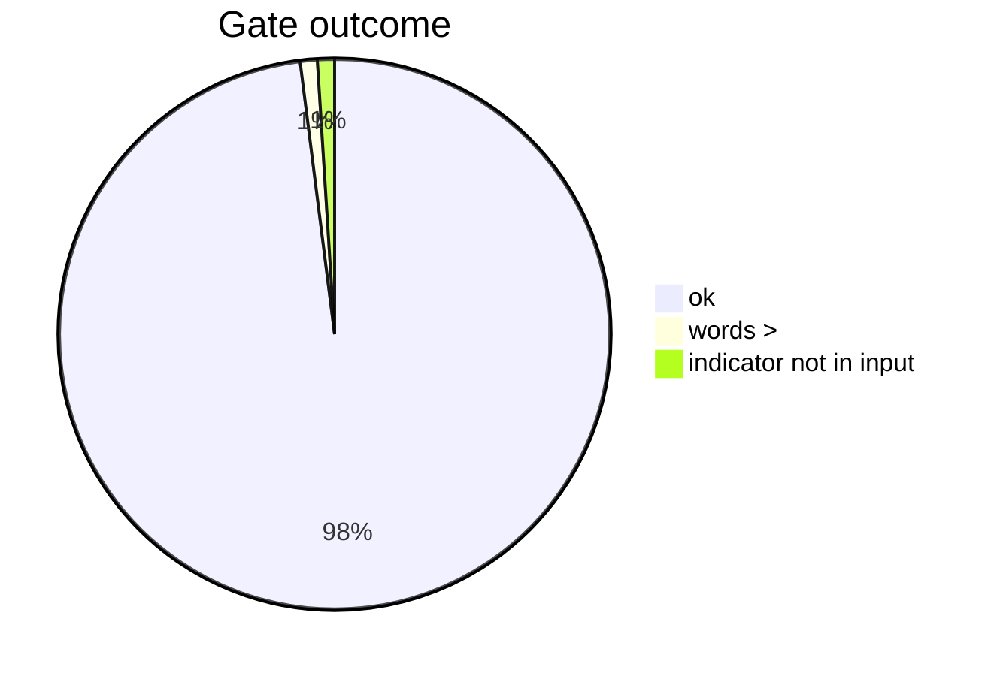
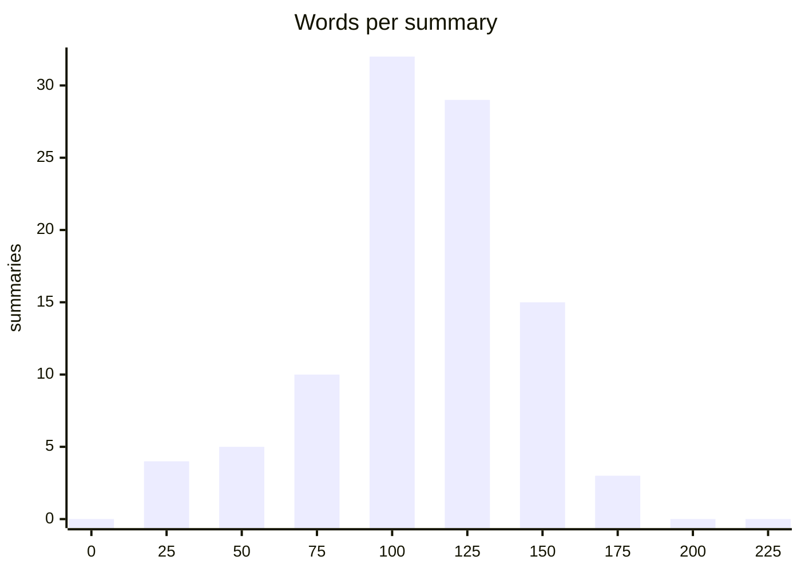

# Summarization benchmark: summary_kind=report

Date: 2026-09-05. Reports: 100, summaries: 98, errors: 2.

- Model: `qwen3.8:latest` digest `22130167c4c2` server `ollama 0.33.2`
- Prompt: `summary-report/qwen3.8-v2` v2 sha256 `702a911fb51766663251ce3bd008f0e8eb8e07d112f1189a0290d87c4bd4dc7d`; headings ['## Threat', '## Targets', '## Indicators', '## Recommended actions']; max words 200

**Method.** No reference summaries exist, so this measures the module's own gate (headings, length, no indicator that is not in the input), length, how much of the regex baseline's hashes/IPs/URLs the summary mentions (coverage, informational: a good summary need not list every hash), timing, and determinism between two passes with the same seed (byte-identical, and word-level similarity otherwise).

## Gate

| outcome / gate problem (one error can carry several) | count |
|---|---|
| summary produced | 98 |
| indicator not in input | 1 |
| words > | 1 |



## Length (words, headings excluded by the gate; limit 200)

| min | median | p90 | max |
|---|---|---|---|
| 29 | 122.500 | 165 | 187 |



## Headings present

| heading | summaries |
|---|---|
| ## Threat | 98 |
| ## Targets | 98 |
| ## Indicators | 98 |
| ## Recommended actions | 98 |

## Indicator coverage (share of the reference md5/sha1/sha256/ip-dst/url mentioned)

| reports with indicators | mean coverage | median |
|---|---|---|
| 88 | 0.318 | 0.213 |

## Timing

| median s | p90 s | max s | total min |
|---|---|---|---|
| 4.665 | 6.963 | 9.183 | 7.958 |

## Determinism (second pass, same seed and temperature 0)

| paired | byte-identical | mean word similarity | min similarity |
|---|---|---|---|
| 98 | 98 | 1.000 | 1.000 |

## Per report

| id | title | status | words | coverage | seconds | identical | similarity |
|---|---|---|---|---|---|---|---|
| 00414a04 | SoumniBot: the new Android banker’s uniq | ok | 132 | 0.800 | 4.591 | True | 1.000 |
| 014c75a7 | US aerospace services provider breached  | ok | 105 | 0.000 | 2.913 | True | 1.000 |
| 0173351d | Chafer: Latest Attacks Reveal Heightened | ok | 184 | 0.250 | 5.149 | True | 1.000 |
| 03e9e845 | ErrorFather's Cerberus: Amplifying Cyber | ok | 91 | 0.033 | 4.824 | True | 1.000 |
| 07e04656 | 2022-03-11 - New Wiper Malware Attacking | ok | 126 | 0.250 | 4.755 | True | 1.000 |
| 082d3389 | Cutting Edge, Part 3: Investigating Ivan | ok | 169 | 0.312 | 8.199 | True | 1.000 |
| 09ce4b89 | 2017-10-05 - FreeMilk- A Highly Targeted | ok | 127 | 0.056 | 5.150 | True | 1.000 |
| 0d759389 | 2017-10-13 - FIN7 Dissected- Hackers Acc | ok | 148 |  | 3.283 | True | 1.000 |
| 0e1ee8a9 | 2017-11-15 - New EMOTET Hijacks a Window | ok | 136 | 0.455 | 5.259 | True | 1.000 |
| 10524cc8 | 2020-03-21 - On the Royal Road | ok | 86 | 0.167 | 7.748 | True | 1.000 |
| 114744a5 | 2020-05-04 - ATM malware targets Wincor  | ok | 101 | 0.667 | 3.590 | True | 1.000 |
| 11def925 | CryptoClippy is Evolving to Pilfer Even  | ok | 166 | 0.089 | 7.182 | True | 1.000 |
| 12b3fde8 | SonicALERT: CVE 2014-0322 Malware - Saku | ok | 121 | 0.000 | 3.216 | True | 1.000 |
| 13edb894 | 2009-08-05 - PC Users Threatened by Conf | ok | 124 |  | 3.530 | True | 1.000 |
| 1405a5dc | Authorities confirm RagnarLocker ransomw | ok | 130 | 0.000 | 3.715 | True | 1.000 |
| 198f65d2 | DanaBot: A New Banking Trojan Targeting  | ok | 127 | 0.278 | 6.352 | True | 1.000 |
| 20649884 | North Korean hackers are skimming US and | ok | 182 | 0.250 | 5.052 | True | 1.000 |
| 226d6c53 | 2014-05-13 - Cat Scratch Fever- CrowdStr | ok | 114 |  | 3.221 | True | 1.000 |
| 283b3f32 | Cloud Security - Palo Alto Networks Blog | ok | 58 | 0.000 | 3.344 | True | 1.000 |
| 2dd4dea5 | 2020-11-18 - Business as usual- Criminal | ok | 95 | 0.625 | 5.820 | True | 1.000 |
| 2ddc0184 | Latest Cyber Threat Intelligence & Secur | ok | 143 | 0.000 | 5.841 | True | 1.000 |
| 36f4a46a | 2020-09-17 - Complex obfuscation- Meh… ( | ok | 117 | 0.462 | 4.761 | True | 1.000 |
| 37cabd68 | Rorschach – A New Sophisticated and Fast | ok | 122 | 0.750 | 6.494 | True | 1.000 |
| 3b452297 | 2022-04-14 - Orion Threat Alert- Flight  | ok | 141 | 0.333 | 6.442 | True | 1.000 |
| 3e098fcf |  | ok | 62 | 0.125 | 4.188 | True | 1.000 |
| 40301ca4 | 2018-11-27 - Meet CrowdStrike’s Adversar | ok | 136 |  | 3.280 | True | 1.000 |
| 405f54ff | MMD-0064-2019 - Linux/AirDropBot | ok | 156 | 0.172 | 8.326 | True | 1.000 |
| 428fd94c | Threat Analysis: Active C2 Discovery Usi | ok | 140 | 0.750 | 4.203 | True | 1.000 |
| 43cd6667 |  | ok | 125 |  | 2.875 | True | 1.000 |
| 45f70928 | 2010-03-07 - March 2010 Opachki Trojan u | ok | 41 | 1.000 | 3.911 | True | 1.000 |
| 4c375f8c | 2021-11-18 - Two Iranian Nationals Charg | ok | 173 |  | 4.196 | True | 1.000 |
| 4e697d2e | Adobe To Announce Source Code, Customer  | ok | 131 | 1.000 | 3.316 | True | 1.000 |
| 52cbaed5 | 2020-04-08 - How Cyber Adversaries are A | ok | 161 |  | 4.399 | True | 1.000 |
| 536e5094 | Gamaredon group grows its game | ok | 167 | 0.500 | 6.518 | True | 1.000 |
| 53d99aad | CAPEC-163: Spear Phishing (Version 3.9) | ok | 144 | 1.000 | 4.141 | True | 1.000 |
| 53ecd031 | 2022-11-15 - New RapperBot Campaign – We | ok | 141 | 0.208 | 6.414 | True | 1.000 |
| 540efc3c | 2020-05-21 - No “Game over” for the Winn | ok | 133 | 0.059 | 6.213 | True | 1.000 |
| 59058517 | 2021-06-17 - New TA402 Molerats Malware  | ok | 140 | 0.429 | 6.718 | True | 1.000 |
| 5b6dbdb5 | 2016-11-08 - Analysis of iOSGuiInject Ad | ok | 119 | 0.104 | 5.068 | True | 1.000 |
| 5f36e25e | Web skimmers found on the websites of In | ok | 70 | 0.000 | 2.254 | True | 1.000 |
| 5ffd1c8b | 2021-10-21 - Cobalt Strike- Using Known  | ok | 117 |  | 2.946 | True | 1.000 |
| 64b77888 | 2020-12-15 - Removing Coordinated Inauth | ok | 164 |  | 4.691 | True | 1.000 |
| 662a629b | IssueMakersLab - Cyber Warfare Research  | ok | 152 | 0.455 | 4.263 | True | 1.000 |
| 68303cde | 1,400 Pegasus spyware infections detaile | ok | 123 | 0.000 | 3.862 | True | 1.000 |
| 6970d678 | Yokogawa announcement warns of counterfe | ok | 119 | 0.000 | 3.077 | True | 1.000 |
| 69b2b5d5 | 2020-12-02 - ‘Shadow Academy’ Targets 20 | ok | 125 |  | 3.277 | True | 1.000 |
| 69b95dce |  | ok | 118 | 0.022 | 9.183 | True | 1.000 |
| 6cc03d12 | New Apple Mac Trojan Called OSX/Crisis D | ok | 149 | 0.500 | 3.941 | True | 1.000 |
| 6eeb84e3 | 2020-01-23 - German language malspam pus | ok | 80 | 0.312 | 4.470 | True | 1.000 |
| 712ff0fc | Hagga of SectorH01 continues abusing Bit | ok | 165 | 0.136 | 6.500 | True | 1.000 |
| 731ff89d | New “CleverSoar” Installer Targets Chine | ok | 140 | 0.400 | 4.652 | True | 1.000 |
| 78d08d87 | ZINC weaponizing open-source software |  | ok | 134 | 0.267 | 5.885 | True | 1.000 |
| 79a42502 | Some notes on IoCs | ok | 105 | 0.000 | 2.882 | True | 1.000 |
| 7a32ec7f |  | ok | 166 | 0.000 | 7.190 | True | 1.000 |
| 7d02b3fa | New threat actor, UAT-9921, leverages Vo | ok | 154 | 0.000 | 4.590 | True | 1.000 |
| 7d044e79 | 2022-01-21 - A deeper UEFI dive into Moo | ok | 108 | 1.000 | 3.675 | True | 1.000 |
| 7d04b6ff | Rancor: Cyber Espionage Group Uses New C | ok | 77 | 0.188 | 5.032 | True | 1.000 |
| 80f461c7 | Unwrapping Ursnifs Gifts - The DFIR Repo | ok | 114 | 0.008 | 7.545 | True | 1.000 |
| 881ef0cf | 2021-04-12 - A chat with DarkSide | error | 0 |  | 5.720 |  |  |
| 88425055 | Equinix data center giant hit by Netwalk | ok | 131 | 0.500 | 3.203 | True | 1.000 |
| 8cb9ac5c | Operation Bleeding Bear | ok | 109 | 0.714 | 5.779 | True | 1.000 |
| 8e804b2b | With Upgrades in Delivery and Support In | ok | 111 | 0.000 | 3.211 | True | 1.000 |
| 93f7b554 | 2020-10-11 - Chimera, APT19 under the ra | ok | 74 | 0.600 | 4.379 | True | 1.000 |
| 94486493 | Research, News, and Perspectives | ok | 137 | 0.000 | 3.228 | True | 1.000 |
| 97271a6a | Probable Iranian Cyber Actors, Static Ki | ok | 112 | 0.048 | 4.605 | True | 1.000 |
| 9a7625d2 | 2021-04-14 - An Update- The COVID-19 Vac | ok | 122 | 0.091 | 5.749 | True | 1.000 |
| 9d745433 |  | ok | 122 | 0.500 | 5.207 | True | 1.000 |
| 9fcc0e30 | Parrot TDS takes over web servers and th | ok | 187 | 0.200 | 5.523 | True | 1.000 |
| a5d54f81 | 2019-05-02 - Detricking TrickBot Loader | ok | 97 | 0.217 | 5.351 | True | 1.000 |
| a9b8e5c7 | Important Detection and Remediation Acti | ok | 112 | 1.000 | 2.820 | True | 1.000 |
| b131f886 | IcedID Campaign Spotted Being Spiced Wit | ok | 100 | 0.208 | 5.577 | True | 1.000 |
| b376f09a | Advisories are published, but are enough | ok | 122 | 0.000 | 3.132 | True | 1.000 |
| bd43481b | LAPSUS$: Recent techniques, tactics and  | ok | 162 | 1.000 | 4.312 | True | 1.000 |
| be97537d | 2023-01-26 - Welcome to Goot Camp- Track | ok | 112 | 0.114 | 6.963 | True | 1.000 |
| c143dbde | HP_Bromium_Threat_Insights_Report_Q4_202 | ok | 153 | 0.000 | 4.669 | True | 1.000 |
| c191576a |  | error | 0 |  | 7.085 |  |  |
| c266b9cf | Daxin Backdoor: In-Depth Analysis, Part  | ok | 119 | 0.667 | 5.349 | True | 1.000 |
| c58b4df0 | FBI seize BreachForums hacking forum use | ok | 126 | 0.000 | 3.723 | True | 1.000 |
| c91d14a0 | ZIP files, make it bigger to avoid EDR d | ok | 90 | 0.500 | 2.881 | True | 1.000 |
| c9acfc88 | 2021-11-02 - Underminer Exploit Kit- The | ok | 116 | 0.273 | 5.100 | True | 1.000 |
| ca2af944 | Waterbear Returns, Uses API Hooking to E | ok | 107 | 0.250 | 6.322 | True | 1.000 |
| cc13367a | Enterprise Scale Threat Hunting: C2 Beac | ok | 79 | 0.000 | 2.488 | True | 1.000 |
| cc825515 | 2022-08-25 - New Golang Ransomware Agend | ok | 77 | 1.000 | 7.003 | True | 1.000 |
| d0d69f14 | VERMIN: Quasar RAT and Custom Malware Us | ok | 126 | 0.077 | 6.812 | True | 1.000 |
| d1d74b29 | Nobelium Returns to the Political World  | ok | 119 | 1.000 | 5.032 | True | 1.000 |
| d256214e | 2017-07-24 - Real News, Fake Flash- Mac  | ok | 135 | 0.333 | 4.492 | True | 1.000 |
| d27118be | A Pretty Dope Story About Bears: Early I | ok | 118 | 1.000 | 3.237 | True | 1.000 |
| d43f68c1 | CVE-2022-23812 | RIAEvangelist/node-ipc  | ok | 126 | 0.778 | 5.577 | True | 1.000 |
| d72a26f9 | 2023-01-24 - DragonSpark - Attacks Evade | ok | 138 | 0.235 | 5.286 | True | 1.000 |
| d740af4f | Enabling or disabling Lockdown mode on a | ok | 111 | 0.000 | 3.351 | True | 1.000 |
| e0234eb8 | Passive Income of Cyber Criminals: Disse | ok | 116 | 0.667 | 4.662 | True | 1.000 |
| e0f1ad2e | Blackhole Ramnit - samples and analysis | ok | 170 | 0.172 | 6.699 | True | 1.000 |
| e4fec4d0 | 2020-12-22 - Leftover Lunch- Finding, Hu | ok | 126 | 0.067 | 6.416 | True | 1.000 |
| e60bcd10 | 2022-12-20 - Lazarus APT’s Operation Int | ok | 113 | 1.000 | 3.255 | True | 1.000 |
| ea50871d | COVID-19 and New Year greetings: an inve | ok | 97 | 0.065 | 5.701 | True | 1.000 |
| eda4d990 | Windows PWDUMP tools | ok | 29 | 0.000 | 1.885 | True | 1.000 |
| f22ca523 | Secure Communications Blog | ok | 29 | 0.000 | 1.754 | True | 1.000 |
| f9158c72 | Medre.A - AutoCAD worm samples | ok | 66 | 0.312 | 4.715 | True | 1.000 |
| fbb37538 | Censys Blog | Cybersecurity Insights & T | ok | 29 | 0.000 | 1.408 | True | 1.000 |
| fdb2627c | Treasury Sanctions China-based Hacker In | ok | 165 | 0.000 | 3.692 | True | 1.000 |

## Reproduce

```bash
GENERIC_AI_REQUEST_TIMEOUT=900 python -m benchmarks.run_llm --use-case summarization --kind report
GENERIC_AI_REQUEST_TIMEOUT=900 python -m benchmarks.run_llm --use-case summarization --kind report --results-dir benchmarks/results-pass2
python -m benchmarks.compare_summary --kind report --second-dir benchmarks/results-pass2
```
