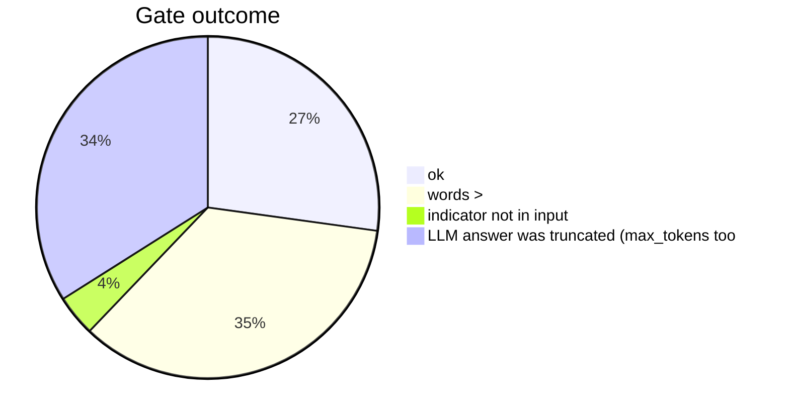
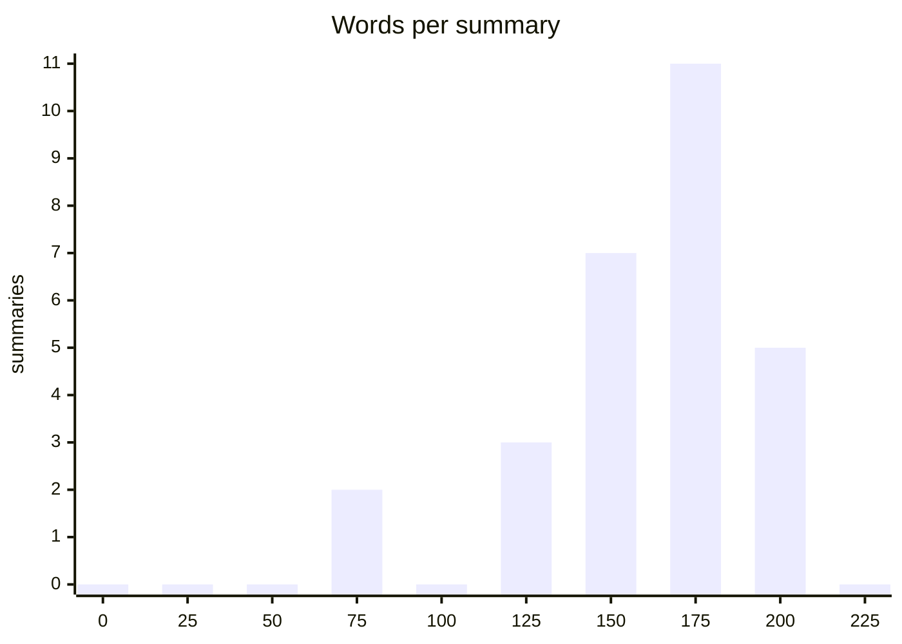

# Summarization benchmark: report summaries on the orkl sample

Date: 2026-09-05. Reports: 100, summaries: 28, errors: 72.

- Model: `qwen3.8:latest` digest `22130167c4c2` server `ollama 0.33.2`
- Prompt: `summary-report/qwen3.8-v1` v1 sha256 `22dc0a98abda8ed8cd1977ea2c1a4f1e910e0fa26a645414768a31002bd2fff1`; headings ['## Threat', '## Targets', '## Indicators', '## Recommended actions']; max words 200

**Method.** No reference summaries exist, so this measures the module's own gate (headings, length, no indicator that is not in the input), length, how much of the regex baseline's hashes/IPs/URLs the summary mentions (coverage, informational: a good summary need not list every hash), timing, and determinism between two passes with the same seed (byte-identical, and word-level similarity otherwise).

## Gate

| outcome / gate problem (one error can carry several) | count |
|---|---|
| summary produced | 28 |
| LLM answer was truncated (max_tokens too | 35 |
| indicator not in input | 4 |
| words > | 36 |



## Length (words, headings excluded by the gate; limit 200)

| min | median | p90 | max |
|---|---|---|---|
| 81 | 183.500 | 205 | 208 |



## Headings present

| heading | summaries |
|---|---|
| ## Threat | 28 |
| ## Targets | 28 |
| ## Indicators | 28 |
| ## Recommended actions | 28 |

## Indicator coverage (share of classic md5/sha1/sha256/ip-dst/url mentioned)

| reports with indicators | mean coverage | median |
|---|---|---|
| 26 | 0.421 | 0.322 |

## Timing

| median s | p90 s | max s | total min |
|---|---|---|---|
| 6.313 | 8.750 | 13.587 | 10.629 |

## Determinism (second pass, same seed and temperature 0)

| paired | byte-identical | mean word similarity | min similarity |
|---|---|---|---|
| 27 | 27 | 1.000 | 1.000 |

## Per report

| id | title | status | words | coverage | seconds | identical | similarity |
|---|---|---|---|---|---|---|---|
| 00414a04 | SoumniBot: the new Android banker’s uniq | ok | 157 | 0.800 | 4.796 | True | 1.000 |
| 014c75a7 | US aerospace services provider breached  | error | 0 |  | 4.674 |  |  |
| 0173351d | Chafer: Latest Attacks Reveal Heightened | error | 0 |  | 6.716 |  |  |
| 03e9e845 | ErrorFather's Cerberus: Amplifying Cyber | ok | 178 | 0.100 | 7.398 |  |  |
| 07e04656 | 2022-03-11 - New Wiper Malware Attacking | error | 0 |  | 6.437 |  |  |
| 082d3389 | Cutting Edge, Part 3: Investigating Ivan | error | 0 |  | 9.640 |  |  |
| 09ce4b89 | 2017-10-05 - FreeMilk- A Highly Targeted | error | 0 |  | 7.111 |  |  |
| 0d759389 | 2017-10-13 - FIN7 Dissected- Hackers Acc | error | 0 |  | 4.332 |  |  |
| 0e1ee8a9 | 2017-11-15 - New EMOTET Hijacks a Window | error | 0 |  | 5.942 |  |  |
| 10524cc8 | 2020-03-21 - On the Royal Road | error | 0 |  | 8.750 |  |  |
| 114744a5 | 2020-05-04 - ATM malware targets Wincor  | ok | 208 | 0.667 | 5.101 | True | 1.000 |
| 11def925 | CryptoClippy is Evolving to Pilfer Even  | error | 0 |  | 8.104 |  |  |
| 12b3fde8 | SonicALERT: CVE 2014-0322 Malware - Saku | error | 0 |  | 4.646 |  |  |
| 13edb894 | 2009-08-05 - PC Users Threatened by Conf | ok | 183 |  | 4.660 | True | 1.000 |
| 1405a5dc | Authorities confirm RagnarLocker ransomw | ok | 190 | 0.000 | 7.548 | True | 1.000 |
| 198f65d2 | DanaBot: A New Banking Trojan Targeting  | error | 0 |  | 7.909 |  |  |
| 20649884 | North Korean hackers are skimming US and | ok | 205 | 0.083 | 5.812 | True | 1.000 |
| 226d6c53 | 2014-05-13 - Cat Scratch Fever- CrowdStr | error | 0 |  | 5.000 |  |  |
| 283b3f32 | Cloud Security - Palo Alto Networks Blog | ok | 154 | 0.000 | 4.568 | True | 1.000 |
| 2dd4dea5 | 2020-11-18 - Business as usual- Criminal | error | 0 |  | 6.933 |  |  |
| 2ddc0184 | Latest Cyber Threat Intelligence & Secur | error | 0 |  | 7.653 |  |  |
| 36f4a46a | 2020-09-17 - Complex obfuscation- Meh… ( | error | 0 |  | 6.294 |  |  |
| 37cabd68 | Rorschach – A New Sophisticated and Fast | error | 0 |  | 8.014 |  |  |
| 3b452297 | 2022-04-14 - Orion Threat Alert- Flight  | error | 0 |  | 6.841 |  |  |
| 3e098fcf |  | ok | 154 | 0.062 | 7.325 | True | 1.000 |
| 40301ca4 | 2018-11-27 - Meet CrowdStrike’s Adversar | ok | 185 |  | 3.872 | True | 1.000 |
| 405f54ff | MMD-0064-2019 - Linux/AirDropBot | error | 0 |  | 10.244 |  |  |
| 428fd94c | Threat Analysis: Active C2 Discovery Usi | error | 0 |  | 5.315 |  |  |
| 43cd6667 |  | error | 0 |  | 3.818 |  |  |
| 45f70928 | 2010-03-07 - March 2010 Opachki Trojan u | error | 0 |  | 5.727 |  |  |
| 4c375f8c | 2021-11-18 - Two Iranian Nationals Charg | error | 0 |  | 6.326 |  |  |
| 4e697d2e | Adobe To Announce Source Code, Customer  | error | 0 |  | 5.502 |  |  |
| 52cbaed5 | 2020-04-08 - How Cyber Adversaries are A | error | 0 |  | 5.119 |  |  |
| 536e5094 | Gamaredon group grows its game | error | 0 |  | 7.457 |  |  |
| 53d99aad | CAPEC-163: Spear Phishing (Version 3.9) | ok | 191 | 0.000 | 4.269 | True | 1.000 |
| 53ecd031 | 2022-11-15 - New RapperBot Campaign – We | error | 0 |  | 6.892 |  |  |
| 540efc3c | 2020-05-21 - No “Game over” for the Winn | error | 0 |  | 8.931 |  |  |
| 59058517 | 2021-06-17 - New TA402 Molerats Malware  | error | 0 |  | 7.177 |  |  |
| 5b6dbdb5 | 2016-11-08 - Analysis of iOSGuiInject Ad | error | 0 |  | 7.352 |  |  |
| 5f36e25e | Web skimmers found on the websites of In | error | 0 |  | 3.967 |  |  |
| 5ffd1c8b | 2021-10-21 - Cobalt Strike- Using Known  | error | 0 |  | 4.132 |  |  |
| 64b77888 | 2020-12-15 - Removing Coordinated Inauth | error | 0 |  | 6.620 |  |  |
| 662a629b | IssueMakersLab - Cyber Warfare Research  | error | 0 |  | 6.300 |  |  |
| 68303cde | 1,400 Pegasus spyware infections detaile | error | 0 |  | 5.331 |  |  |
| 6970d678 | Yokogawa announcement warns of counterfe | error | 0 |  | 4.750 |  |  |
| 69b2b5d5 | 2020-12-02 - ‘Shadow Academy’ Targets 20 | error | 0 |  | 4.718 |  |  |
| 69b95dce |  | error | 0 |  | 11.180 |  |  |
| 6cc03d12 | New Apple Mac Trojan Called OSX/Crisis D | error | 0 |  | 10.106 |  |  |
| 6eeb84e3 | 2020-01-23 - German language malspam pus | error | 0 |  | 5.926 |  |  |
| 712ff0fc | Hagga of SectorH01 continues abusing Bit | error | 0 |  | 7.595 |  |  |
| 731ff89d | New “CleverSoar” Installer Targets Chine | error | 0 |  | 6.686 |  |  |
| 78d08d87 | ZINC weaponizing open-source software |  | error | 0 |  | 7.549 |  |  |
| 79a42502 | Some notes on IoCs | error | 0 |  | 4.910 |  |  |
| 7a32ec7f |  | error | 0 |  | 8.885 |  |  |
| 7d02b3fa | New threat actor, UAT-9921, leverages Vo | error | 0 |  | 5.919 |  |  |
| 7d044e79 | 2022-01-21 - A deeper UEFI dive into Moo | ok | 205 | 1.000 | 5.396 | True | 1.000 |
| 7d04b6ff | Rancor: Cyber Espionage Group Uses New C | error | 0 |  | 7.083 |  |  |
| 80f461c7 | Unwrapping Ursnifs Gifts - The DFIR Repo | error | 0 |  | 10.503 |  |  |
| 881ef0cf | 2021-04-12 - A chat with DarkSide | error | 0 |  | 6.441 |  |  |
| 88425055 | Equinix data center giant hit by Netwalk | error | 0 |  | 4.555 |  |  |
| 8cb9ac5c | Operation Bleeding Bear | error | 0 |  | 7.164 |  |  |
| 8e804b2b | With Upgrades in Delivery and Support In | ok | 191 | 0.000 | 13.587 | True | 1.000 |
| 93f7b554 | 2020-10-11 - Chimera, APT19 under the ra | ok | 137 | 0.600 | 5.436 | True | 1.000 |
| 94486493 | Research, News, and Perspectives | ok | 184 | 0.000 | 3.813 | True | 1.000 |
| 97271a6a | Probable Iranian Cyber Actors, Static Ki | error | 0 |  | 7.030 |  |  |
| 9a7625d2 | 2021-04-14 - An Update- The COVID-19 Vac | error | 0 |  | 5.733 |  |  |
| 9d745433 |  | ok | 154 | 1.000 | 6.153 | True | 1.000 |
| 9fcc0e30 | Parrot TDS takes over web servers and th | error | 0 |  | 6.524 |  |  |
| a5d54f81 | 2019-05-02 - Detricking TrickBot Loader | error | 0 |  | 6.492 |  |  |
| a9b8e5c7 | Important Detection and Remediation Acti | error | 0 |  | 4.229 |  |  |
| b131f886 | IcedID Campaign Spotted Being Spiced Wit | error | 0 |  | 6.605 |  |  |
| b376f09a | Advisories are published, but are enough | error | 0 |  | 4.361 |  |  |
| bd43481b | LAPSUS$: Recent techniques, tactics and  | error | 0 |  | 5.605 |  |  |
| be97537d | 2023-01-26 - Welcome to Goot Camp- Track | error | 0 |  | 8.800 |  |  |
| c143dbde | HP_Bromium_Threat_Insights_Report_Q4_202 | error | 0 |  | 6.199 |  |  |
| c191576a |  | error | 0 |  | 8.382 |  |  |
| c266b9cf | Daxin Backdoor: In-Depth Analysis, Part  | ok | 150 | 0.667 | 6.592 | True | 1.000 |
| c58b4df0 | FBI seize BreachForums hacking forum use | error | 0 |  | 5.463 |  |  |
| c91d14a0 | ZIP files, make it bigger to avoid EDR d | error | 0 |  | 5.585 |  |  |
| c9acfc88 | 2021-11-02 - Underminer Exploit Kit- The | error | 0 |  | 6.287 |  |  |
| ca2af944 | Waterbear Returns, Uses API Hooking to E | error | 0 |  | 7.307 |  |  |
| cc13367a | Enterprise Scale Threat Hunting: C2 Beac | ok | 164 | 0.000 | 3.822 | True | 1.000 |
| cc825515 | 2022-08-25 - New Golang Ransomware Agend | ok | 129 | 1.000 | 8.497 | True | 1.000 |
| d0d69f14 | VERMIN: Quasar RAT and Custom Malware Us | error | 0 |  | 8.610 |  |  |
| d1d74b29 | Nobelium Returns to the Political World  | ok | 139 | 1.000 | 5.714 | True | 1.000 |
| d256214e | 2017-07-24 - Real News, Fake Flash- Mac  | error | 0 |  | 6.911 |  |  |
| d27118be | A Pretty Dope Story About Bears: Early I | ok | 189 | 1.000 | 4.160 | True | 1.000 |
| d43f68c1 | CVE-2022-23812 | RIAEvangelist/node-ipc  | ok | 203 | 0.333 | 6.891 | True | 1.000 |
| d72a26f9 | 2023-01-24 - DragonSpark - Attacks Evade | error | 0 |  | 6.718 |  |  |
| d740af4f | Enabling or disabling Lockdown mode on a | error | 0 |  | 5.055 |  |  |
| e0234eb8 | Passive Income of Cyber Criminals: Disse | ok | 197 | 0.333 | 6.049 | True | 1.000 |
| e0f1ad2e | Blackhole Ramnit - samples and analysis | ok | 208 | 0.310 | 7.510 | True | 1.000 |
| e4fec4d0 | 2020-12-22 - Leftover Lunch- Finding, Hu | ok | 198 | 0.000 | 7.715 | True | 1.000 |
| e60bcd10 | 2022-12-20 - Lazarus APT’s Operation Int | ok | 194 | 1.000 | 4.827 | True | 1.000 |
| ea50871d | COVID-19 and New Year greetings: an inve | error | 0 |  | 7.551 |  |  |
| eda4d990 | Windows PWDUMP tools | ok | 156 | 0.000 | 4.262 | True | 1.000 |
| f22ca523 | Secure Communications Blog | ok | 81 | 0.000 | 2.486 | True | 1.000 |
| f9158c72 | Medre.A - AutoCAD worm samples | error | 0 |  | 7.188 |  |  |
| fbb37538 | Censys Blog | Cybersecurity Insights & T | ok | 94 | 1.000 | 2.670 | True | 1.000 |
| fdb2627c | Treasury Sanctions China-based Hacker In | error | 0 |  | 5.027 |  |  |

## Reproduce

```bash
GENERIC_AI_REQUEST_TIMEOUT=900 python -m benchmarks.run_llm --use-case summarization
GENERIC_AI_REQUEST_TIMEOUT=900 python -m benchmarks.run_llm --use-case summarization --results-dir benchmarks/results-pass2
python -m benchmarks.compare_summary --second-dir benchmarks/results-pass2
```
